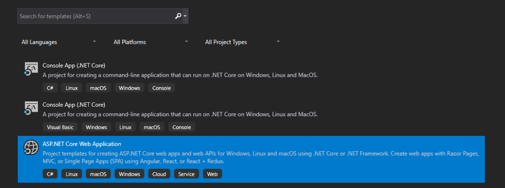
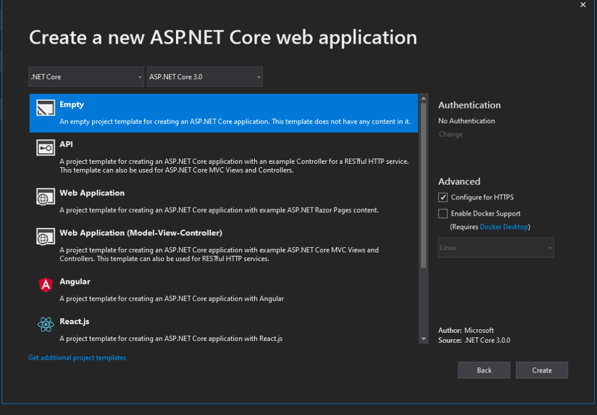
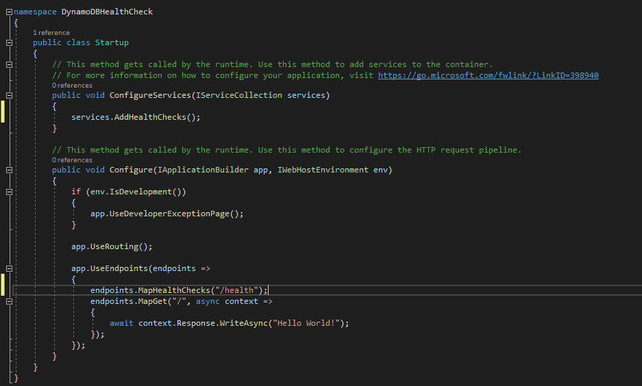
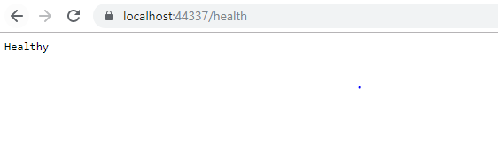
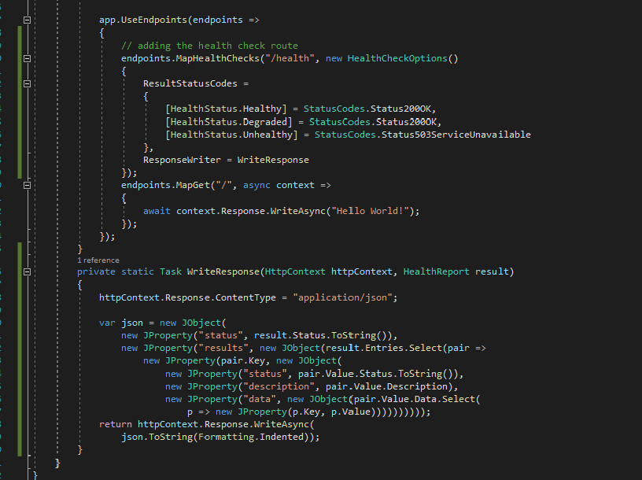
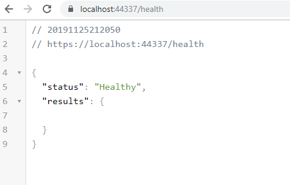

ASP.NET core offer health checks Middlewares for reporting health of an application and its different components. You can expose the health check of an app as HTTP endpoint or you can choose to publish the health of an app at certain intervals to a source such as a queue.

In this blog we will be exploring getting the health stats of an api that uses dynamoDb as it data store. For this tutorial we will be using,

-   Visual studio 2019
-   dotetcore 3
-   Downloadable DynamoDB which can be found [here](https://docs.aws.amazon.com/amazondynamodb/latest/developerguide/DynamoDBLocal.DownloadingAndRunning.html) which would also need the latest version of Java SDK

## Create ASP.NET Core Web application

Create a new core web application using the Visual studio template and let’s call it DynamoDBHealthCheck and select the API project template.





## Add the required dependencies

Lets add the following dependencies to the solution

-   [dotnet add package AWSSDK.DynamoDBv2 –version 3.3.103.1](https://www.nuget.org/packages/AWSSDK.DynamoDBv2/3.3.103.1?_src=template)
-   [dotnet add package Microsoft.AspNetCore.Diagnostics.HealthChecks –version 2.2.0](https://www.nuget.org/packages/Microsoft.AspNetCore.Diagnostics.HealthChecks)

## Add health check to Startup.cs

In Startup call we are adding services.AddHealthChecks(); and endpoints.MapHealthChecks(“/health”); to the UseEndpoints Middleware.



If you run the api now you can see the health status of the application at /health url



Lets now also add in some code to get a bit more detailed health status for the application.



If you run the application now you can see a bit more information that just the text **Healthy**. Everything up till now is well documented in the [Microsoft documentation for health checks](https://docs.microsoft.com/en-us/aspnet/core/host-and-deploy/health-checks?view=aspnetcore-3.0).



## Add a health check for DynamoDB

Lets add a new class called “DynamoOptions.cs” for holding all the dynamo db configuration

```csharp
using System;
using System.Collections.Generic;
using System.Linq;
using System.Threading.Tasks;

namespace DynamoDBHealthCheck
{
    public class DynamoOptions
    {
        public string AWSAcessKey { get; set; }
        public string AWSSecretKey { get; set; }
        public string ConnectionString { get; set; }
        public string AuthenticationRegion { get; set; }
    }
}
```


and add the following configuration section to the appsettings.json

```json
{
    "Logging": {
        "LogLevel": {
            "Default": "Information",
            "Microsoft": "Warning",
            "Microsoft.Hosting.Lifetime": "Information"
        }
    },
    "dynamodb": {
        "aWSAcessKey": "fakeKey",
        "aWSSecretKey": "fakeSecret",
        "connectionString": "http://localhost:8000",
        "authenticationRegion": "localhost",
        "tableName": "TestTable"
    },
    "AllowedHosts": "*"
}
```

Lets now add a class “DynamoHealth.cs” that will implement the IHealthCheck interface from the ” Microsoft.Extensions.Diagnostics.HealthChecks” package.

```csharp
using Amazon.DynamoDBv2;
using Amazon.DynamoDBv2.Model;
using Amazon.Runtime;
using Microsoft.Extensions.Diagnostics.HealthChecks;
using System;
using System.Collections.Generic;
using System.Linq;
using System.Threading;
using System.Threading.Tasks;

namespace DynamoDBHealthCheck
{
    public class DynamoHealth: IHealthCheck
    {
        private readonly DynamoOptions _options;
        public DynamoHealth(DynamoOptions options)
        {
            _options = options ?? throw new ArgumentNullException(nameof(options));
        }
        public async Task<HealthCheckResult> CheckHealthAsync(HealthCheckContext context, CancellationToken cancellationToken = default)
        {
            try
            {
                var credentials = new BasicAWSCredentials(_options.AWSAcessKey, _options.AWSSecretKey);
                var config = new AmazonDynamoDBConfig();
                config.AuthenticationRegion = _options.AuthenticationRegion;
                config.ServiceURL = _options.ConnectionString;
                var client = new AmazonDynamoDBClient(credentials, config);
                await client.DescribeTableAsync(_options.TableName,cancellationToken);
                return HealthCheckResult.Healthy();
            }
            catch (Exception ex)
            {
                return new HealthCheckResult(context.Registration.FailureStatus, exception: ex);
            }
        }
    }
}
```
Lets also add an extension methods that can be called on the services.AddHealthChecks() methods from the startup.cs.

```csharp
using Microsoft.Extensions.DependencyInjection;
using Microsoft.Extensions.Diagnostics.HealthChecks;
using System;
using System.Collections.Generic;

namespace DynamoDBHealthCheck
{
    public static class DynamoDbHealthCheckExtensions
    {
        const string NAME = "dynamodb";
        public static IHealthChecksBuilder AddDynamoDb(this IHealthChecksBuilder builder, DynamoOptions options, string name = default, HealthStatus? failureStatus = default, IEnumerable<string> tags = default, TimeSpan? timeout = default)
        {
            return builder.Add(new HealthCheckRegistration(
                name ?? NAME,
                sp => new DynamoHealth(options),
                failureStatus,
                tags,
                timeout));
        }
    }
}
```
We now have to update the startup.cs to include the AddDynamoDb extension. If you run the application now you can see that the health check returns an unhealthy status for overall app and also DynamoDb as shown below.

```csharp
using System;
using System.Collections.Generic;
using System.Linq;
using System.Threading.Tasks;
using Microsoft.AspNetCore.Builder;
using Microsoft.AspNetCore.Diagnostics.HealthChecks;
using Microsoft.AspNetCore.Hosting;
using Microsoft.AspNetCore.Http;
using Microsoft.Extensions.Configuration;
using Microsoft.Extensions.DependencyInjection;
using Microsoft.Extensions.Diagnostics.HealthChecks;
using Microsoft.Extensions.Hosting;
using Newtonsoft.Json;
using Newtonsoft.Json.Linq;

namespace DynamoDBHealthCheck
{
    public class Startup
    {
        public Startup(IConfiguration configuration)
        {
            Configuration = configuration;
        }
        public IConfiguration Configuration { get;}
        
        public void ConfigureServices(IServiceCollection services)
        {
            // Adding the health check services
            services.AddHealthChecks()
                     .AddDynamoDb(Configuration.GetSection("dynamodb")
                                               .Get<DynamoOptions>());
        }

        // This method gets called by the runtime. Use this method to configure the HTTP request pipeline.
        public void Configure(IApplicationBuilder app, IWebHostEnvironment env)
        {
            if (env.IsDevelopment())
            {
                app.UseDeveloperExceptionPage();
            }

            app.UseRouting();

            app.UseEndpoints(endpoints =>
            {
                // adding the health check route
                endpoints.MapHealthChecks("/health", new HealthCheckOptions()
                {
                    ResultStatusCodes =
                    {
                        [HealthStatus.Healthy] = StatusCodes.Status200OK,
                        [HealthStatus.Degraded] = StatusCodes.Status200OK,
                        [HealthStatus.Unhealthy] = StatusCodes.Status503ServiceUnavailable
                    },
                    ResponseWriter = WriteResponse
                });
                endpoints.MapGet("/", async context =>
                {
                    await context.Response.WriteAsync("Hello World!");
                });
            });
        }
        private static Task WriteResponse(HttpContext httpContext, HealthReport result)
        {
            httpContext.Response.ContentType = "application/json";

            var json = new JObject(
                new JProperty("status", result.Status.ToString()),
                new JProperty("results", new JObject(result.Entries.Select(pair =>
                    new JProperty(pair.Key, new JObject(
                        new JProperty("status", pair.Value.Status.ToString()),
                        new JProperty("description", pair.Value.Description),
                        new JProperty("data", new JObject(pair.Value.Data.Select(
                            p => new JProperty(p.Key, p.Value)))))))));
            return httpContext.Response.WriteAsync(
                json.ToString(Formatting.Indented));
        }
    }
}
```

```json
{
    "status": "Unhealthy",
    "results": {
        "dynamodb": {
            "status": "Unhealthy",
            "description": null,
            "data": {
        
            }
        }
    }
}
```

Let’s now make sure a local dynamo db instance is running and we should also create a table called “TestTable” in this local instance. To check whether DyanamoDB’s health we are calling the DescribeTable method which throw an exception when the table is not found.

Instructions on how to run DynamoDB locally can be found [here](https://docs.aws.amazon.com/amazondynamodb/latest/developerguide/DynamoDBLocal.DownloadingAndRunning.html). Once we have started the DynamoDB local server and created the “TestTable” health check will return a health status both for the overall system and also dynamodb.


```text
// https://localhost:44337/health
```

```json
{
    "status": "Healthy",
    "results": {
        "dynamodb": {
            "status": "Healthy",
            "description": null,
            "data": {
        
            }
        }
    }
}
```

## Additional Information

-   There is actually a collection of health check nuget packages for different types of products including DynamoDB can be found [here](https://github.com/xabaril/AspNetCore.Diagnostics.HealthChecks). The DynamoDB health check in the package actually uses the ListTable method on Dynamo. However I do prefer to check the existence of the table that my app relies on to run.

-   [The full solution for the code examples used in this blog can be found at my Github](https://github.com/kijoyin/DynamoDBHealthCheck).
