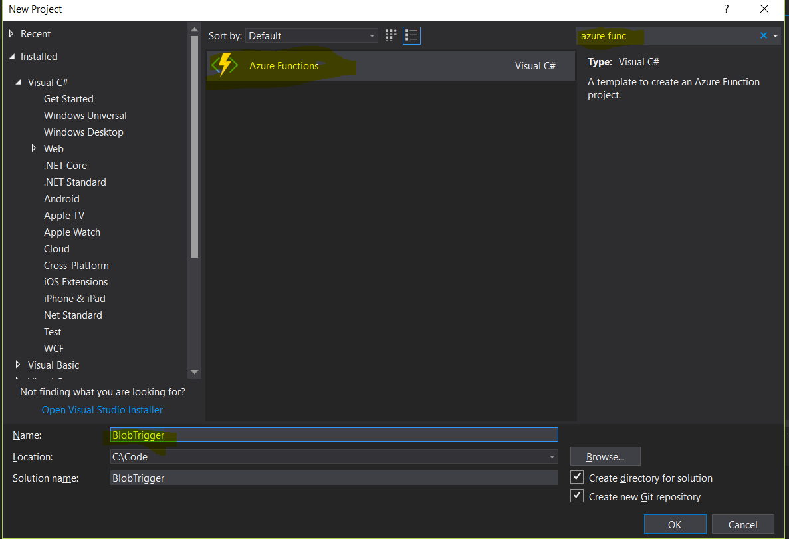
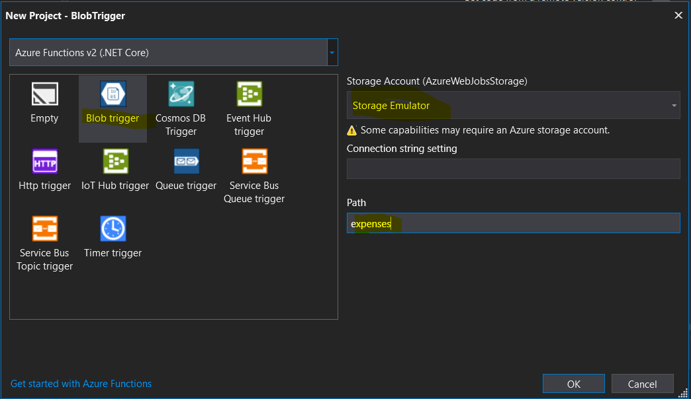
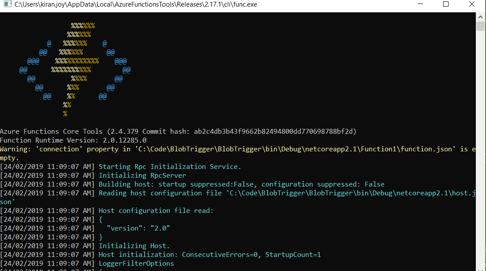
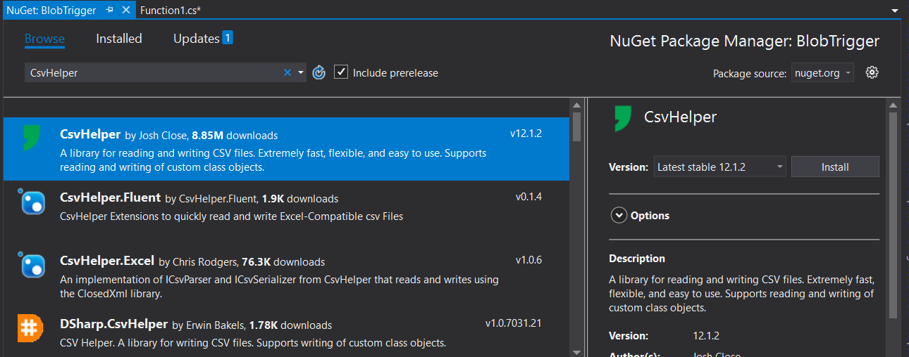

Every time a CSV file is uploaded to Azure blob storage we want to run an Azure function that will process the CSV and upload data to Azure table storage. We will be using Visual Studio 2017 and Azure Storage explorer for development and testing locally.

#### Prerequisites

-   Download an install Azure storage expolore – [here](https://azure.microsoft.com/en-us/features/storage-explorer/)
-   Make sure Azure workflows and SDKS are installed for Visual Studio version of your choice. While we are using Visual Studion 2017 and storage explorer here , everything we are doing here can be done directly from Azure portal

#### Creating Azure functions App

In Visual Studio create new Project and then select the “Azure functions template”. Name the project “BlobTrigger”.



Create Azure functions App

On the next window select “Blog trigger” and for Storage Account Select “Storage emulator”.You don’t have to add any connection strings, as by default it will connected to the storage account azure functions app is linked to (In our case it is the storage emulator). For Path let’s type in in “expenses”. This is the container name for your blob storage to which you will be uploading the CSV files. If you want to add additional types of functions , you can add them to the project later.



Create blob trigger

The default template would have created the below function for you.

```
using System.IO;
using Microsoft.Azure.WebJobs;
using Microsoft.Azure.WebJobs.Host;
using Microsoft.Extensions.Logging;

namespace BlobTrigger
{
    public static class Function1
    {
        [FunctionName("Function1")]
        public static void Run([BlobTrigger("expenses/{name}", Connection = "")]Stream myBlob, string name, ILogger log)
        {
            log.LogInformation($"C# Blob trigger function Processed blob\n Name:{name} \n Size: {myBlob.Length} Bytes");
        }
    }
}
```

Pressing “F5” should run the function locally should popup a command line console similar to below one and you can see all your logs in this windows.



Running functions

Add a reference to CSVHelper using Nuget, to help with processing the CSV. You can chose to use any CSV library



Adding CSV helper

Below is the final code that reads data from the CSV and uploads it to table storage. You can choose to upload the data to any type of data storage but for simplicity, we are selecting table storage.

```
using System;
using System.Collections.Generic;
using System.IO;
using CsvHelper;
using Microsoft.Azure.WebJobs;
using Microsoft.Azure.WebJobs.Host;
using Microsoft.Extensions.Logging;
using Microsoft.WindowsAzure.Storage.Table;

namespace BlobTrigger
{
    public static class Function1
    {
        [FunctionName("Function1")]
        public static void Run([BlobTrigger("expenses/{name}.csv", Connection = "AzureWebJobsStorage")]Stream myBlob, string name,
            [Table("Expenses", Connection = "AzureWebJobsStorage")] IAsyncCollector<Expense> expenseTable,
            ILogger log)
        {
            log.LogInformation($"C# Blob trigger function Processed blob\n Name:{name} \n Size: {myBlob.Length} Bytes");
            var records = new List<Expense>();
            using (var memoryStream = new MemoryStream())
            {
                using (var tr = new StreamReader(myBlob))
                {
                    using (var csv = new CsvReader(tr))
                    {
                        if (csv.Read())
                        {
                            log.LogInformation("Reading CSV");
                            csv.ReadHeader();
                            while (csv.Read())
                            {
                                var record = new Expense
                                {
                                    Amount = double.Parse(csv.GetField("Debit")),
                                    Title = csv.GetField("Title"),
                                    PartitionKey = "Expenses",
                                    RowKey = Guid.NewGuid().ToString()
                                };
                                expenseTable.AddAsync(record).Wait();
                                records.Add(record);
                            }
                        }
                    }
                }
            }
        }
    }

    public class Expense: TableEntity
    {
        public string Title { get; set; }
        public double Amount { get; set; }
    }
}
```

#### Function Signature

```
[FunctionName("Function1")]
        public static void Run([BlobTrigger("expenses/{name}.csv", Connection = "AzureWebJobsStorage")]Stream myBlob, string name,
            [Table("Expenses", Connection = "AzureWebJobsStorage")] IAsyncCollector<Expense> expenseTable,
            ILogger log)
```

We have updated the function signature to have a blog trigger path of “expenses/{name}.csv”. Adding the “.csv” ensures that only CSV files trigger the function.

Another addition to function is the Table storage binding which uses table name of “Expenses” and we are using an “Expense” entity which extends “TableEnity”.

#### Testing

Press F5 on Visual studio and start running the Azure functions locally. Add a break-point to the function, so that we can make sure uploading the CSV will triger the “Blob trigger function”.


#### Solution

The full solution can be found in [Github](https://github.com/kijoyin/azure-blob-trigger)
