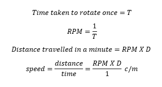
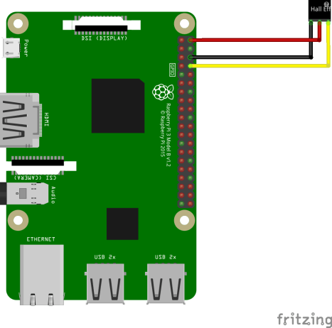
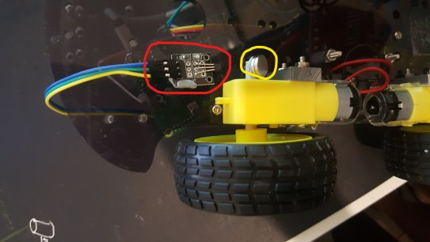
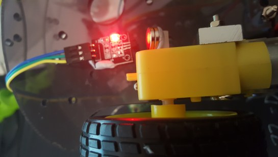
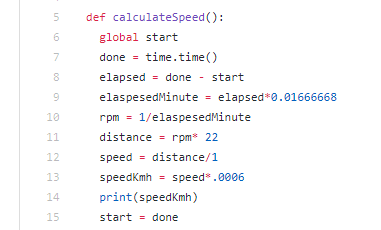

We are preparing for a workshop on V2X and for the actual demo we are building a car that runs on Raspberry Pi. One of the requirements is to calculate the speed of the car. While it is never going to be accurate, it is simple enough to calculate the speed using a Hall effect sensor.

## Theory and formula

We will be using the Hall effect sensor and a magnet to find the number of times the car wheel rotated in a minute.The sensor and magnet will be placed in a such a way that at a particular point in every rotation of the wheel the sensor will detect the magnet. This will tell us how long it will take for one rotation of the wheel and from this we can calculate the number of rotations in a minute.Multiplying the rotations per minute with the diameter of the car will give the distance traveled in a minute.

> T = Time in minutes
> 
> D = Diameter in centimeter

## Materials Needed

1.  Raspberry Pi – We could easily build this using any micro-controller but for this tutorial we are using a Raspberry Pi
2.  [Hall Effect sensor](https://www.jaycar.com.au/arduino-compatible-hall-effect-sensor-module/p/XC4434)
3.  Magnets
4.  [DIY Car Chassis](https://www.jaycar.com.au/4-wheel-drive-motor-chassis-robotics-kit/p/KR3162)

## Connecting Hall Effect Sensor to Raspberry Pi

As per the diagram we are connecting the positive terminal of the sensor to Pin 2 (5V) and the negative to Pin 6(Ground). The signal pin of the hall effect sensor is connected to Pin 8(BCM 14). Signal pin on the above linked hall effect sensor is marked with an **“S”** next to it.Here is a link to [Raspberry Pi pin-out diagram](https://pinout.xyz/) for reference.

## 

## Positioning the Sensor and the Magnet

For the sensor to properly detect the magnet they both have to be placed at a certain distance from each other. The chassis that I used had a small shaft on the back side and that seemed the perfect location to stick the magnet.

Red Circle contains the Hall effect sensor and the Yellow circle contains the Magnets

Sensor is activated when the Magnet is closer to the sensor

## Code

The original code has been taken from [here](https://bitbucket.org/MattHawkinsUK/rpispy-misc/raw/master/python/hall.py) and is modified ito calculate speed instead of just detecting the magnet. Also author of this code Matt has a nicely written [blog](https://www.raspberrypi-spy.co.uk/2015/09/how-to-use-a-hall-effect-sensor-with-the-raspberry-pi/) on detecting sensor changes for hall effect sensor.

The modified code can be found [here.](https://gist.github.com/kijoyin/276b0c91801b9f1807fb20119440442b)

Below function gets called whenever a magnet is detected. One of the draw backs of this code is that the first measurement of speed is always wrong and it is not very accurate. Basically are using the start and done to find out the time between each magnet detection and then converting it to minute (Ln 9).

Ln 10 calculated the rpm and on Ln 11 rpm is multiplied with 22 cm which was the diameter of wheel and on Ln 12 we calculate the speed in Cm per minute.

