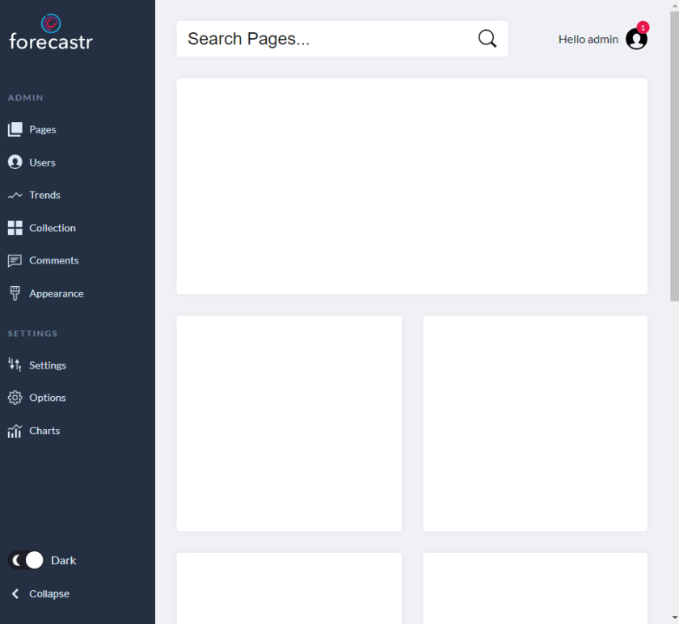
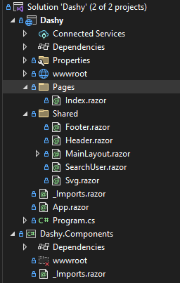
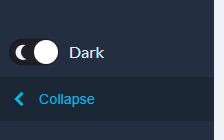

In this blog series we are going to try to take an existing Admin template and convert it into a Blazor project. In this first part we are simply going to add the basic functionality.

To keep this simple we are going to [use this](https://webdesign.tutsplus.com/tutorials/building-an-admin-dashboard-layout-with-css-and-a-touch-of-javascript--cms-33964) tutorial from [Tutplus](https://tutsplus.com/) by [George Martsoukos](https://tutsplus.com/authors/george-martsoukos). This is a very simple Admin template with a header menu , content area and a top header section with search as seen below

All the code for this blog can be found in [GitHub](https://github.com/kijoyin/Dashy). The git repo contains different branches that will match the different sections of the blog. Master branch contains the final code, if you want to have a look.

## HTML and CSS

[Github Link](https://github.com/kijoyin/Dashy/tree/styles)

All the HTML and CSS for this tutorial is copied from the Codepen in the original [Tutplus article](https://webdesign.tutsplus.com/tutorials/building-an-admin-dashboard-layout-with-css-and-a-touch-of-javascript--cms-33964). Lets start start by creating the project structure. For the purpose of the article we are going to call our template **Dashy** and we are going to create 2 projects in our solution **Dashy** and **Dashy.Components**.

**Dashy** will the Blazor web assembly project where we will create the Admin template and **Dashy.Components** will be the where we will create any reusable components.

Follow the below 2 links if you are not sure how to create these 2 projects.

-   [Create a Blazor web assembly project](https://docs.microsoft.com/en-us/learn/modules/build-blazor-web) and name it **Dashy**
-   [Create a Razor class library](https://docs.microsoft.com/en-us/aspnet/core/razor-pages/ui-class?view=aspnetcore-6.0&tabs=visual-studio) and name it **Dashy.Components**

In this stage we are simply going to copy over the HTML and CSS to the **Dashy** with a simple goal of creating a UI and looks like the original article. In the Tutplus article all the HTML was in index.html and the CSS was in a single CSS file. We are going to keep the CSS in a single file for now but we will be splitting the html into manageable components.

Below code is copied into index.html. The key here is we have the app.css file linked (ln 9) which contains all the CSS from the original article. Inside the body of the html we have some Blazor specific html elements. Blazor uses the div with id of “app” (Ln 17) to load Blazor components and the div with id “blazor-error-ui” (Ln 19) will display if anything goes wrong when the Blazor components load.

&lt;!DOCTYPE html&gt;
&lt;html lang="en"&gt;

&lt;head&gt;
    &lt;meta charset="utf-8" /&gt;
    &lt;meta name="viewport" content="width=device-width, initial-scale=1.0, maximum-scale=1.0, user-scalable=no" /&gt;
    &lt;title&gt;Dashy&lt;/title&gt;
    &lt;base href="/" /&gt;
    &lt;link href="css/app.css" rel="stylesheet" /&gt;
    &lt;link href="Dashy.styles.css" rel="stylesheet" /&gt;
    &lt;link href="manifest.json" rel="manifest" /&gt;
    &lt;link rel="apple-touch-icon" sizes="512x512" href="icon-512.png" /&gt;
    &lt;link rel="apple-touch-icon" sizes="192x192" href="icon-192.png" /&gt;
&lt;/head&gt;

&lt;body&gt;
    &lt;div id="app"&gt;Loading...&lt;/div&gt;

    &lt;div id="blazor-error-ui"&gt;
        An unhandled error has occurred.
        &lt;a href="" class="reload"&gt;Reload&lt;/a&gt;
        &lt;a class="dismiss"&gt;🗙&lt;/a&gt;
    &lt;/div&gt;
    &lt;script src="\_framework/blazor.webassembly.js"&gt;&lt;/script&gt;
    &lt;script&gt;navigator.serviceWorker.register('service-worker.js');&lt;/script&gt;
&lt;/body&gt;

&lt;/html&gt;

MainLayout.razor was updated to represent the html structure of the template as seen below.

@inherits LayoutComponentBase
<Svg></Svg>
<Header></Header>
<section class="page-content">
    <SearchUser/>
    @Body
    <Footer/>
</section>

Here as part of this we have now also split the html into different components.

-   Svg – Contains the SVG element in the original html
-   Header – Represents the left side navigation menu as was in the original html
-   SearchUser – Is the top search box and the logged in user representation area
-   Footer – Contains the footer element
-   @Body – Tag displays the content based on the selected route. For the purpose of this tutorial we will be using Index.razor for the main content which will be routed by Blazor at the root (/)

At this stage all the components are stored in the Shared folder along with the MainLayout.razor and Index.razor is in the pages folder. If you have been following along your solution should look somewhat like the screenshot on the right side.

We are currently not utilizing the Dashy.Components project at all but as we create more and more reusable components we will move them from the shared folder to the Dashy.Components. One of the benefits of the Dashy.Components Razor class library is that we can publish it as a NuGet package for other UI projects to consume and in most cases the same class library can be consumed by Blazor WASM and Blazor Server side.

If you run the Dashy Project you will get a UI that is the same as the one in the original screen shot but if you click on the themes button at the bottom or the collapse button nothing will happen. This is because we haven’t yet written any code that will replace the Javascript in the original tutorial.

## Toggle Header

[Github Link](https://github.com/kijoyin/Dashy/tree/ToggleHeader)

In this section we are going to look into our first real code when we attempt to implement the collapse header functionality. Now it is almost impossible to achieve something that doesn’t involve any Javascript at all but Blazor this cool [js interop](https://docs.microsoft.com/en-us/aspnet/core/blazor/javascript-interoperability/call-javascript-from-dotnet?view=aspnetcore-6.0) that will make it easier to call and Javascript code that we need to make the site work.

Once such scenario is if we have to select and element that is outside the scope of Blazor. An example of this would be the html element or the body element. I would hope at some point Blazor will add support to directly interacting with those element but for now we need some Javascript.

I have added BodyElement.js to the scripts folder in the wwwroot folder. The Javascript is quite simply and it simply selects the Body element and then have a few methods add, update or toggle the class of the body element.

var getBodyElement = function () {
    return document.getElementsByTagName("body")\[0\];
}

var setCssClassOfBody = function (cssClass) {
    getBodyElement().className = cssClass;
}

var addCssClassToBody = function (cssClass) {
    var body = getBodyElement();

    if (!body.classList.contains(cssClass)) {
        body.classList.add(cssClass);
    }
}

var removeCssClassFromBody = function (cssClass) {
    var body = getBodyElement();
    if (body.classList.contains(cssClass))
        body.classList.remove(cssClass);
}

var toggleCssClassOfBody = function (cssClass) {
    var body = getBodyElement();

    if (body.classList.contains(cssClass)) {
        removeCssClassFromBody(cssClass);
    }
    else {
        addCssClassToBody(cssClass);
    }
}

var setLanguageOfBody = function (language) {
    var body = getBodyElement();
    body.lang = language;
}

var setTextDirectionOfBody = function (direction) {
    var body = getBodyElement();
    body.dir = direction;
}

We then simply add the link to the Javascript in the index.html and from then on any component can call the methods in the Javascript code using the Javascript Interop methods in Blazor.

The original article toggle the header by adding a collapsed class to the body element and rest of the behavior is achieved by using CSS magic. Feel free to [refer to the original article](https://webdesign.tutsplus.com/tutorials/building-an-admin-dashboard-layout-with-css-and-a-touch-of-javascript--cms-33964) if you want to know more.

In our case rest of the code change is going to be in Header.razor where we need to add a click event to the “collapse-btn”. The original author also had added aria tags to support accessibility and I have also kept them as is.

In the below section you can see that I have added a onclick event that calls the “ToggleCollapse” button and we are using a boolean of “isExpaned” to update the aria tags.

<button class="collapse-btn" aria-expanded="@isExpaned" aria-label="@(isExpaned?"collapse menu":"expand menu")" @onclick="ToggleCollapse">
          <svg aria-hidden="true">
            <use xlink:href="#collapse"></use>
          </svg>
          Collapse
</button>

You can see the C# code to support the click event and the variables in the code block at the bottom of the Header.razor.

@inject IJSRuntime JSRuntime // added at the top of the component
@code
{
    private string collapsedClass = "collapsed"; // CSS class to be added to the body to collapse the menu
    private bool isExpaned = true; // We are using this to track the status of menu to update aria tags
    private async Task ToggleCollapse()
    {
        //Here we can using the JSRuntime  to call the toggleCssClassOfBody method in the javascript which 
           simply updates the class of the body attribute
        await JSRuntime.InvokeVoidAsync("toggleCssClassOfBody", collapsedClass);
        isExpaned = !isExpaned;
    }
}

If you run the Dashy Project now you can see that the UI hasn’t changed but clicking the collapse button on the bottom left of the UI will collapse the menus.

## Toggle Theme Switch

[Github](https://github.com/kijoyin/Dashy/tree/ToggleTheme) [Link](https://github.com/kijoyin/Dashy/tree/ToggleHeader)

In this section we are going to toggle the theme switch which will change the theme from the Dark mode to the light mode and vice versa. The original author goes into a great level of detail on the CSS and JS script for this.

For us to implement this the code is very similar to the code we added to support the “Collapse” button. This is because the original author achieve this also by toggling a class but this time on the html element instead of the body element.

So we are going back to our original Javascript and modify it so that it can select any HTML element and modify classes on it. You can see the new Javascript as below. The only difference now is you can also pass in the element name with the function, so you can select any HTML element and update the CSS class on it.

var getElement = function (element) {
    return document.getElementsByTagName(element)\[0\];
}

var setCssClassOfElement = function (element,cssClass) {
    getElement(element).className = cssClass;
}

var addCssClassToElement = function (element,cssClass) {
    var element = getElement(element);

    if (!element.classList.contains(cssClass)) {
        element.classList.add(cssClass);
    }
}

var removeCssClassFromElement = function (element,cssClass) {
    var element = getElement(element);
    if (element.classList.contains(cssClass))
        element.classList.remove(cssClass);
}

var toggleCssClassOfElement = function (element, cssClass) {
    
    var elementItem = getElement(element);
    if (elementItem.classList.contains(cssClass)) {
        removeCssClassFromElement(element,cssClass);
    }
    else {
        addCssClassToElement(element,cssClass);
    }
}

var setLanguageOfElement = function (element,language) {
    var element = getElement(element);
    element.lang = language;
}

var setTextDirectionOfElement = function (element,direction) {
    var element = getElement(element);
    element.dir = direction;
}

With the JS changes out of the way all we have to do is update the Header.Razor with another click even that will toggle the CSS class on the html element.

          <input type="checkbox" id="mode" checked @onchange="ToggleTheme">
          <label for="mode">
            
            @(isDarkMode?"Dark":"Light")
          </label>
 

And the C# for the click events. We have also updated our previous collapse menu to use the new Javascript method that needs to pass the extra element name.

@code
{
    private string collapsedClass = "collapsed";
    private string lightModeClass = "light-mode";
    private bool isExpaned = true;
    private bool isDarkMode = true;
    private async Task ToggleCollapse()
    {
        await JSRuntime.InvokeVoidAsync("toggleCssClassOfElement", "body",collapsedClass);
        isExpaned = !isExpaned;
    }
    private async Task ToggleTheme()
    {
        await JSRuntime.InvokeVoidAsync("toggleCssClassOfElement", "html",lightModeClass);
        isDarkMode = !isDarkMode;
    }
}

If you run the code now you can click on the Dark check box at the bottom left to switch to Light theme and vice versa.

## Parting note

In [part 2](https://kiranjoy.blog/2022/06/29/convert-an-html-admin-template-to-blazor-2/) of this series we will look into how we can start adding more features to support responsiveness including the mobile menu and tooltips.
