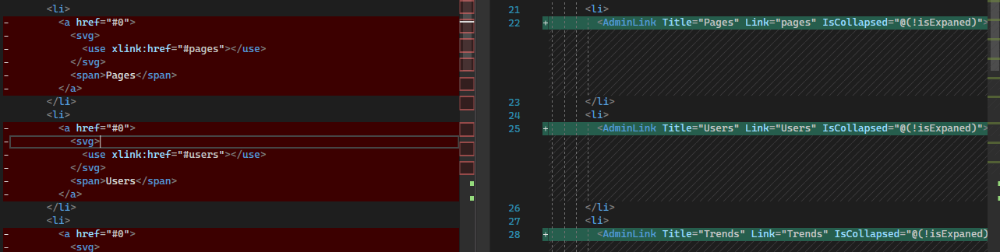

In [part 1](<https://kiranjoy.blog/2022/06/29/convert-an-html-admin-template-to-blazor-1/\(opens in a new tab\)>) of this blog series [we took a HTML, CSS , Javascript Admin template](https://webdesign.tutsplus.com/tutorials/building-an-admin-dashboard-layout-with-css-and-a-touch-of-javascript--cms-33964) and converted it to use Blazor. In part 2 we are going to add additional features to this template including adding theme persistence and responsiveness.

## Persist selected theme on page load

[Github Link](https://github.com/kijoyin/Dashy/tree/ToggleThemeLocalStorage)

For this we will be using a [nuget package](https://www.nuget.org/packages/Blazored.LocalStorage/4.2.0) “[Blazored.LocalStorage](https://github.com/Blazored/LocalStorage)” to support local storage. Instructions on how to add can be found [here](https://github.com/Blazored/LocalStorage).

Once the library is added we only need to change the Header.Razor to store the current theme in local storage. In our case we only have 2 themes and so we will be storing a Boolean variable “isDarkMode” to indicate if it is dark mode or light mode.

In On Initialized we are checking if the variable is set in the local storage and if set we are using that value to set the theme. Since our default mode is dark mode , we only change the theme if the local storage is not dark theme.

Another change to the code is when the theme is changed the Boolean value is toggled and stored in local storage.

@code
{
    private string collapsedClass = "collapsed";
    private string lightModeClass = "light-mode";
    private string darKModeStorageKey = "isDarkMode";
    private bool isExpaned = true;
    private bool isDarkMode = true;
    protected override async Task OnInitializedAsync()
    {
        if (await localStorage.ContainKeyAsync(darKModeStorageKey))
        {
            isDarkMode = await localStorage.GetItemAsync<bool>(darKModeStorageKey);
            if(!isDarkMode)
            {
               await JSRuntime.InvokeVoidAsync("toggleCssClassOfElement", "html",lightModeClass); 
            }
        }
        else
        {
            await localStorage.SetItemAsync<bool>(darKModeStorageKey, isDarkMode);
        }
    }
    private async Task ToggleCollapse()
    {
        await JSRuntime.InvokeVoidAsync("toggleCssClassOfElement", "body",collapsedClass);
        isExpaned = !isExpaned;
    }
    private async Task ToggleTheme()
    {
        await JSRuntime.InvokeVoidAsync("toggleCssClassOfElement", "html",lightModeClass);
        isDarkMode = !isDarkMode;
        await localStorage.SetItemAsync<bool>(darKModeStorageKey, isDarkMode);
    }
}

## Show tool tip on Admin Menu Items

[Github Link](https://github.com/kijoyin/Dashy/tree/AdminMenuToolTip)

This is quite simple and all we are doing is when the menu is collapse we are adding a title attribute anchor tag. The original article talks about adding the title when the mouse enters the link. However in our case we are going to add it when the menu is collapsed. As long as I can see the behavior is still the same. It only displays the tool tip when the mouse enters the link.

For this one we are going to start using the “Dashy.Components” and we are going to create a new component called AdminLink. This component simply represents a single menu item and is represented by the below code.

<a href="@Link" title="@(IsCollapsed?Title:"")">
    <svg>
        <use href="@($"#{Title.ToLower()}")"></use>
    </svg>
    @Title
</a>

@code {
    \[Parameter\] public string Title { get; set; }
    \[Parameter\] public string Link { get; set; }
    \[Parameter\] public bool IsCollapsed { get; set; }
}

This component takes Title, Link and the state of the menu (as in collapsed or not). If the menu is collapsed , it simply adds the value of the Title parameter to the title attribute of the anchor tag. To use this component in our Dashy Project we simply need to add a project reference in **Dashy** for **Dashy.Components** and added **@using Dashy.Components** to **\_Imports.razor** in **Dashy** so we can use it in any component.

Now that we have a simple component to represent a menu item we can simply refactor the Header.Razor and the comparison of the old vs the new code is as below. We are replacing a block of code with a single component that behaves the same with the added ability to show tool tips when the menu is collapsed. IsCollapsed parameter of the component is populated using the isExpanded variable in Header.Razor which indicates if the menu is collapsed or not.

A note to add here is by no means Header.Razor is written in an efficient reusable manner As you can see most of the menu items are repeated with just Title and Link variables being different. In a future section we will look at optimizing the menu and loading it dynamically from some data source.

## Going Responsive

[Github](https://github.com/kijoyin/Dashy/tree/ToggleMobileMenu) [Link](https://github.com/kijoyin/Dashy/tree/AdminMenuToolTip)

The HTML and CSS of this template is already responsive and if you reduce the width of the screen to something less than 768px you can see the UI adapts to be small screen friendly and the Admin Menu will move to a toggle button on the top header. The only problem is when the user clicks on this button nothing happens. The expected behavior is for it to display an menu drop down and the original author achieved it using Javascript.

Original author is using a button click on “toggle-mob-menu” button to set a class on the body element and so this is very similar to the code we have seen when we added the collapse menu option.

So Lets start by adding a click event to the button. Here we are also matching the aria tags as per the original article.

 <button class="toggle-mob-menu" aria-expanded="@isMobileClosed" aria-label="@(isMobileClosed?"close menu":"open menu")" @onclick="ToggleMobileMenu">
      <svg width="20" height="20" aria-hidden="true">
        <use xlink:href="#down"></use>
      </svg>
    </button>

The button click is implemented in the code block as below. Again we are using Js Interop to update the class on the body element when the button is clicked.

    private bool isMobileClosed = true;
    private async Task ToggleMobileMenu()
    {
        await JSRuntime.InvokeVoidAsync("toggleCssClassOfElement", "body",toggleMobileMenuClass);
        isMobileClosed = !isMobileClosed;
    }

## Parting note

At this stage we have implemented all the functionality mentioned in the original article. In the next part of this series we will look at implementing more advanced Blazor features to improve up on this template in an attempt to try and see if we can make it a fully-fledged Admin template.
