One of the biggest problem I always had with both Lambda and Azure Functions was that they introduce cloud specific code, especially if you want to expose something over http. On top of that Lambda could not even run by it own in most cases, especially if you want to expose an http api endpoint.

However things may be improving on the lambda side with the announcement of dotnet6 support for lambda announced [here](https://aws.amazon.com/blogs/compute/introducing-the-net-6-runtime-for-aws-lambda/). The key here is the introduction of the [Amazon.Lambda.AspNetCoreServer.Hosting](https://www.nuget.org/packages/Amazon.Lambda.AspNetCoreServer.Hosting/) nuget package, with just works as a different hosting model. Also when run outside lambda all Lambda specific code (in this case a simple middleware –**builder.Services.AddAWSLambdaHosting(LambdaEventSource.HttpApi)**) are simply ignored. This means the exact same code can be deployed as Azure Web apps or hosted in IIS or Kestrel in an EC2 instance or Azure VMs.

## Resources

Finished code can be found in [this github repo](https://github.com/kijoyin/LambdaMinimal).

## Notes

The below article talks about deploying a dotnet6 minimal API to Lambda server less but I have also successfully deployed an ASPNET hosted Blazor application without any issues. Other than creating the project itself there is not a lot of difference in the deployment process. I will point it out it sections where any changes are are needed.

This also means Lambda has no problem running a full controller based API site as well. The Blazor project that is part of the Github solution uses the full **WeatherForecastController** when the sample fetch data page is called. If you just want to deploy a full Controller based API without out the Blazor part , the below tutorial can be followed as it is.

## Create a Minimal API

Lets start by creating a simple minimal api project in visual studio using dotnet 6. From the create new project wizard select the API project template and click next.

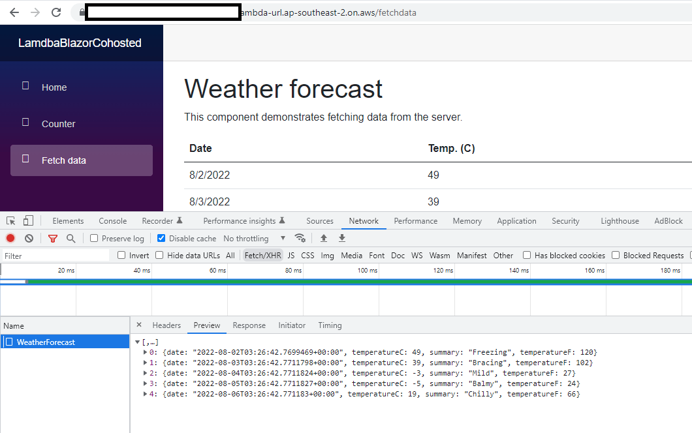

Name the project LambdaMinimalApi and click next

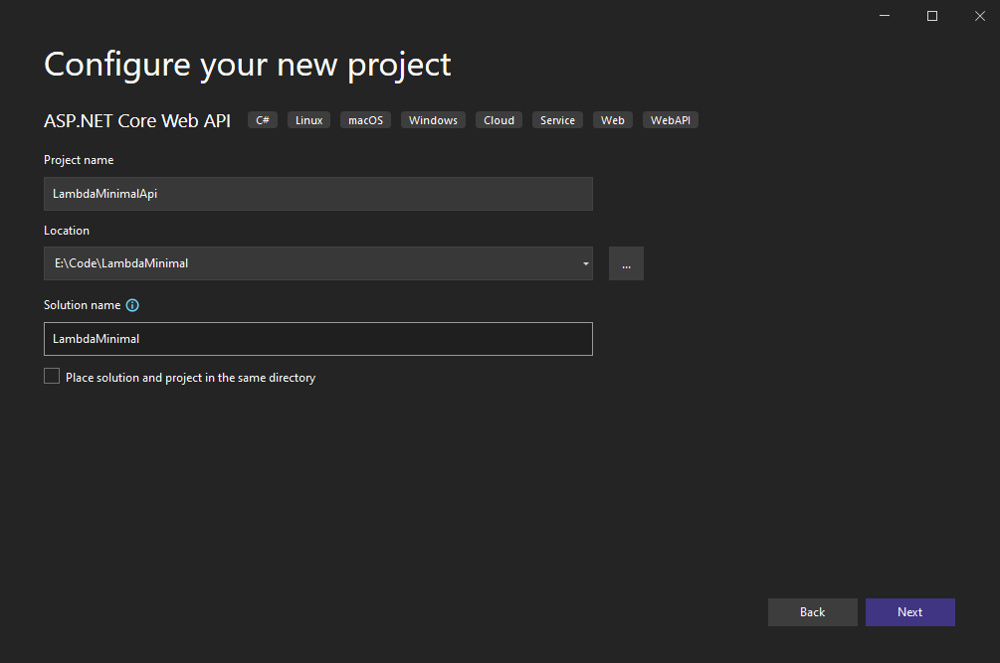

In the next window make sure the Use controllers checkbox is unticked to use minimal api template and click Create.

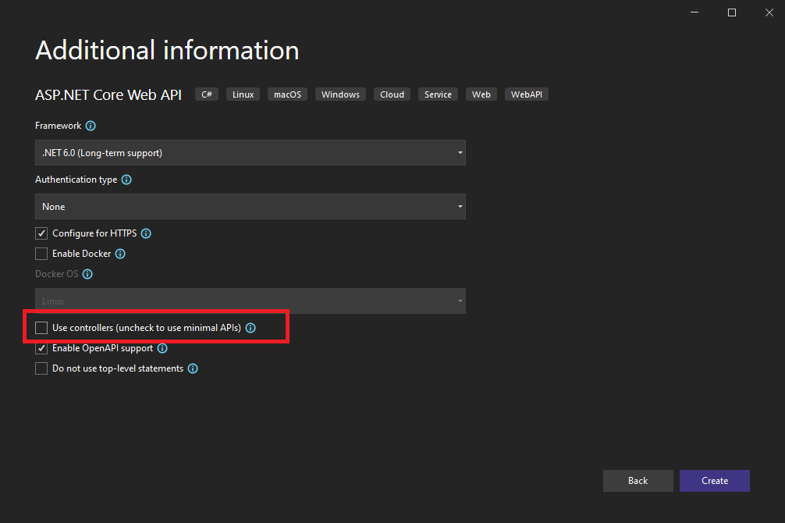

You should have a very simple project with just program.cs and appsettings.json.

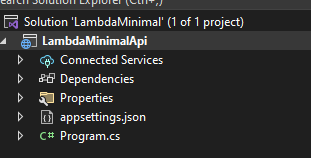

Program.cs has a simple weatherforecast get api

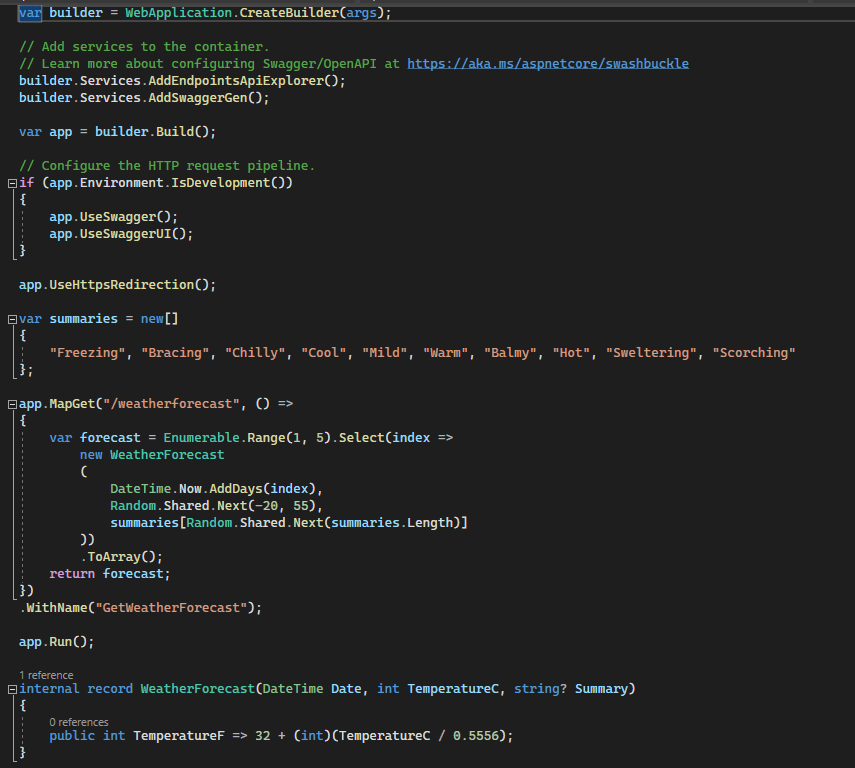

If you run the project now, it loads the default swagger endpoint with just the weather forecast api.

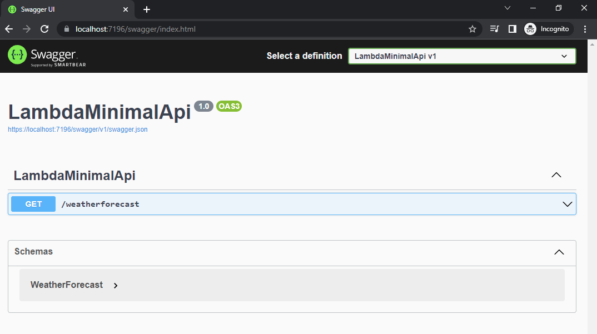

## Adding the Lambda Hosting model

Lets now update the code to include the Lambda hosting model nuget packages and look at the different steps to get it deployed to AWS.

Add the Amazon.Lambda.AspNetCoreServer.Hosting nuget package to the project and update the program.cs include the lambda hosting middleware.

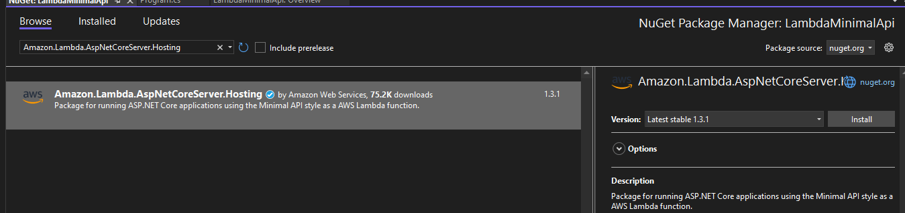

In program.cs add the middleware, which will add the Lambda Hosting model.

**For Blazor** – The below code changes in progam.cs will be done in the program.cs of the server project of the aspnet hosted Blazor project (LamdbaBlazorCohosted.Server in the github solution).

var builder = WebApplication.CreateBuilder(args);

// Add services to the container.
// Learn more about configuring Swagger/OpenAPI at https://aka.ms/aspnetcore/swashbuckle
builder.Services.AddEndpointsApiExplorer();
builder.Services.AddSwaggerGen();
// Add AWS Lambda support.
// Keep in mind we are using the HttpApi, http api eventsource
// This is so that we test usign the the url exposed directly
// by Lambda. Other options exist if you are using AWS API gateway
// or ELB
builder.Services.AddAWSLambdaHosting(LambdaEventSource.HttpApi);

var app = builder.Build();

If you now run the project locally you can still see that it will run without any issues. If you look into the lamdba middleware code you can why this is the case. It is looking for an Environment variable AWS\_LAMBDA\_FUNCTION\_NAME which I am guessing will return the function name and if that is null or empty the code is simply returned.

 public static IServiceCollection AddAWSLambdaHosting(this IServiceCollection services, LambdaEventSource eventSource)
        {
            if (string.IsNullOrEmpty(Environment.GetEnvironmentVariable("AWS\_LAMBDA\_FUNCTION\_NAME")))
            {
                return services;
            }

            Type typeFromHandle;
            switch (eventSource)
            {
                case LambdaEventSource.HttpApi:
                    typeFromHandle = typeof(APIGatewayHttpApiV2LambdaRuntimeSupportServer);
                    break;
                case LambdaEventSource.RestApi:
                    typeFromHandle = typeof(APIGatewayRestApiLambdaRuntimeSupportServer);
                    break;
                case LambdaEventSource.ApplicationLoadBalancer:
                    typeFromHandle = typeof(ApplicationLoadBalancerLambdaRuntimeSupportServer);
                    break;
                default:
                    {
                        DefaultInterpolatedStringHandler defaultInterpolatedStringHandler = new DefaultInterpolatedStringHandler(26, 1);
                        defaultInterpolatedStringHandler.AppendLiteral("Event source type ");
                        defaultInterpolatedStringHandler.AppendFormatted(eventSource);
                        defaultInterpolatedStringHandler.AppendLiteral(" unknown");
                        throw new ArgumentException(defaultInterpolatedStringHandler.ToStringAndClear());
                    }
            }

            Type serverType = typeFromHandle;
            Utilities.EnsureLambdaServerRegistered(services, serverType);
            return services;
        }

## Deploying the Minimal API to AWS Lamdba

Now in this section we are going to deploy the minimal API to AWS. Now there are quite a few options to do this we are going to deploy by simply uploading a Zip of the published dotnet api

Make sure you have the AWS CLI tools installed using the below command. At this point I am assuming you already have the dotnet tooling installed. The AWS CLI probably is not needed but using it to publish the package makes your life a little easier.

dotnet tool install -g Amazon.Lambda.Tools

From the folder where the CSPROJ file exist for the api run the following dotnet cli command

dotnet lambda package -o dist/LambdaMinimalApi.zip

Amazon Lambda Tools for .NET Core applications (5.4.4)
Project Home: https://github.com/aws/aws-extensions-for-dotnet-cli, https://github.com/aws/aws-lambda-dotnet

Executing publish command
Deleted previous publish folder
... invoking 'dotnet publish', working folder 'E:\\Code\\LambdaMinimal\\LambdaMinimal\\LambdaMinimalApi\\bin\\Release\\net6.0\\publish'
... dotnet publish --output "E:\\Code\\LambdaMinimal\\LambdaMinimal\\LambdaMinimalApi\\bin\\Release\\net6.0\\publish" --configuration "Release" --framework "net6.0" /p:GenerateRuntimeConfigurationFiles=true --runtime linux-x64 --self-contained false
... publish: Microsoft (R) Build Engine version 17.2.0+41abc5629 for .NET
... publish: Copyright (C) Microsoft Corporation. All rights reserved.
... publish:   Determining projects to restore...
... publish:   Restored E:\\Code\\LambdaMinimal\\LambdaMinimal\\LambdaMinimalApi\\LambdaMinimalApi.csproj (in 369 ms).
... publish:   LambdaMinimalApi -> E:\\Code\\LambdaMinimal\\LambdaMinimal\\LambdaMinimalApi\\bin\\Release\\net6.0\\linux-x64\\LambdaMinimalApi.dll
... publish:   LambdaMinimalApi -> E:\\Code\\LambdaMinimal\\LambdaMinimal\\LambdaMinimalApi\\bin\\Release\\net6.0\\publish\\
Zipping publish folder E:\\Code\\LambdaMinimal\\LambdaMinimal\\LambdaMinimalApi\\bin\\Release\\net6.0\\publish to E:\\Code\\LambdaMinimal\\LambdaMinimal\\LambdaMinimalApi\\dist\\LambdaMinimalApi.zip
... zipping: Amazon.Lambda.APIGatewayEvents.dll
... zipping: Amazon.Lambda.ApplicationLoadBalancerEvents.dll
... zipping: Amazon.Lambda.AspNetCoreServer.dll
... zipping: Amazon.Lambda.AspNetCoreServer.Hosting.dll
... zipping: Amazon.Lambda.Core.dll
... zipping: Amazon.Lambda.Logging.AspNetCore.dll
... zipping: Amazon.Lambda.RuntimeSupport.dll
... zipping: Amazon.Lambda.Serialization.SystemTextJson.dll
... zipping: appsettings.Development.json
... zipping: appsettings.json
... zipping: LambdaMinimalApi
... zipping: LambdaMinimalApi.deps.json
... zipping: LambdaMinimalApi.dll
... zipping: LambdaMinimalApi.pdb
... zipping: LambdaMinimalApi.runtimeconfig.json
... zipping: Microsoft.OpenApi.dll
... zipping: Swashbuckle.AspNetCore.Swagger.dll
... zipping: Swashbuckle.AspNetCore.SwaggerGen.dll
... zipping: Swashbuckle.AspNetCore.SwaggerUI.dll
Created publish archive (E:\\Code\\LambdaMinimal\\LambdaMinimal\\LambdaMinimalApi\\dist\\LambdaMinimalApi.zip).
Lambda project successfully packaged: E:\\Code\\LambdaMinimal\\LambdaMinimal\\LambdaMinimalApi\\dist\\LambdaMinimalApi.zip

**For Blazor –** With Blazor the lamdba publish didn’t work and that is because for trimming the app should be published as self contained. I ended up using dotnet publish and then zipping up the publish output and that seems to do the trick. One thing to keep in mind is this would mean in most cases your zip file is going to be bigger than 50mb which is the maximum size you can upload using explorer. You will have to upload it to an S3 bucker first if the size is bigger than 50mb. In the GitHub project I just deleted the icons and a few other resources to get it just under 50mb

```
dotnet publish --output "<FolderPathForPublishOutput>" --configuration "Release" --framework "net6.0" /p:GenerateRuntimeConfigurationFiles=true --runtime linux-x64 --self-contained true
```

## Create the function in AWS Console and Deploy

Now that we have a package lets create a Lambda in AWS using the UI and upload the zip file. Keep in mind you can do all these using scripts as well.

1) From the function menu click on the “Create Function” button

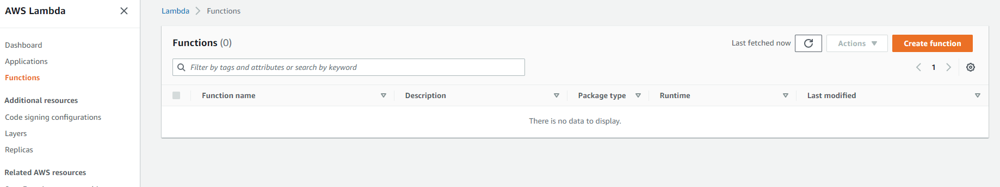

2) Name the function “LambdaMinimalApi” and select “.NET 6” as the runtime. Leave the rest of the fields as it is and press “Create Function”

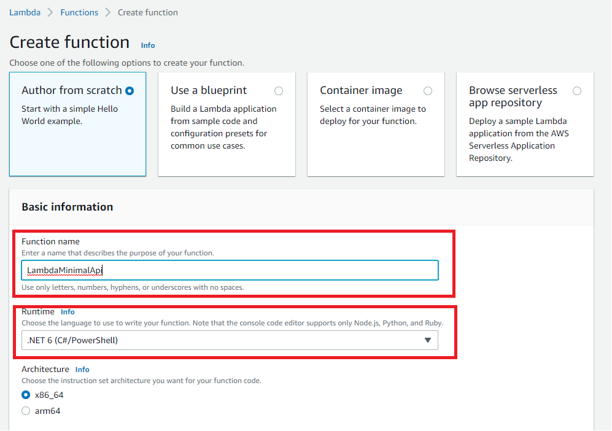

3) You should now have a screen that looks like this. Click on the highlighted “Upload from” to upload the zip file directly.

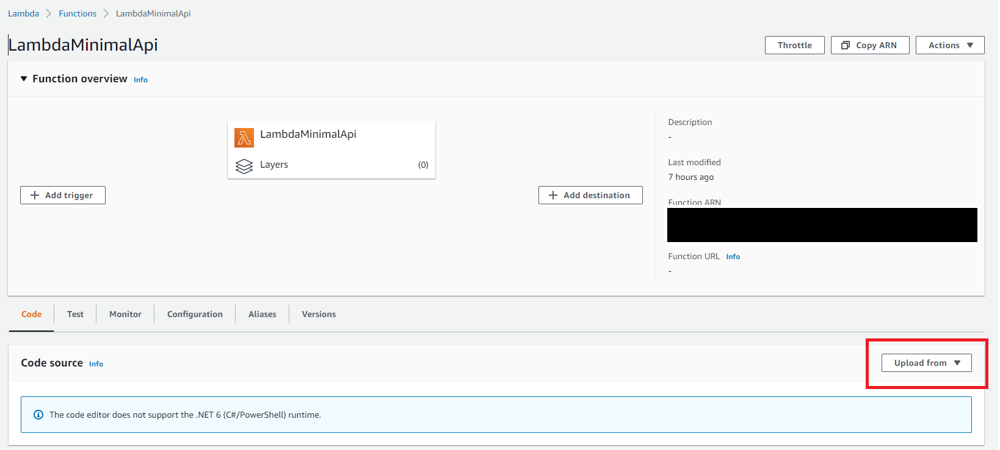

4) One uploaded click on the “Configuration” tab and select “Function URL” section and click “Create Function Url button”, so we can create a URL for directly calling the function.

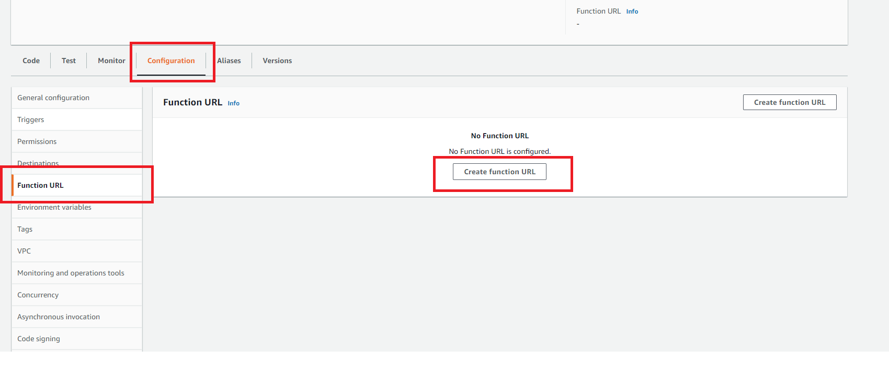

5) From the next screen set the auth type to none and press “Save” button from the bottom right side of the screen. **Keep in mind , in a real world application you will either expose the function through an API gateway or your API will have authorization logic**. You now have a URI that you can call to reach the API. If you call it now you will get an “Internal server error”

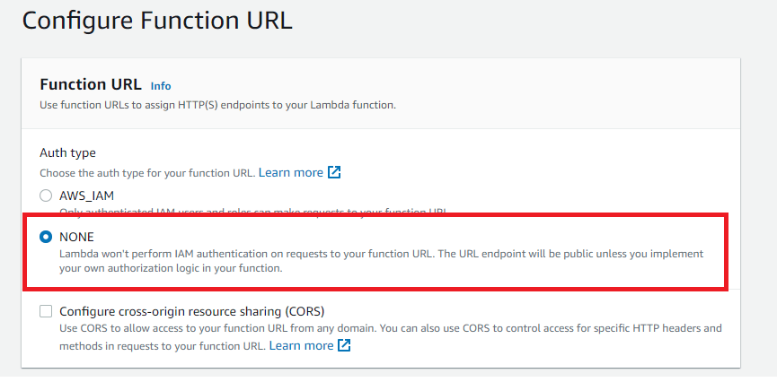

6) Keep not of this URL as you will need it later. You can also find the URL in the “Function overview” section.

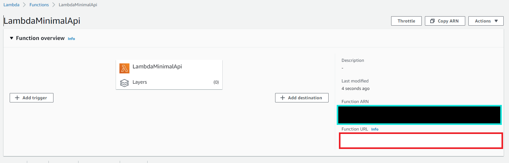

7) Lets update function handler to match the Assembly name. Click on the “Code” tab and click “Edit” on the “Runtime settings”.

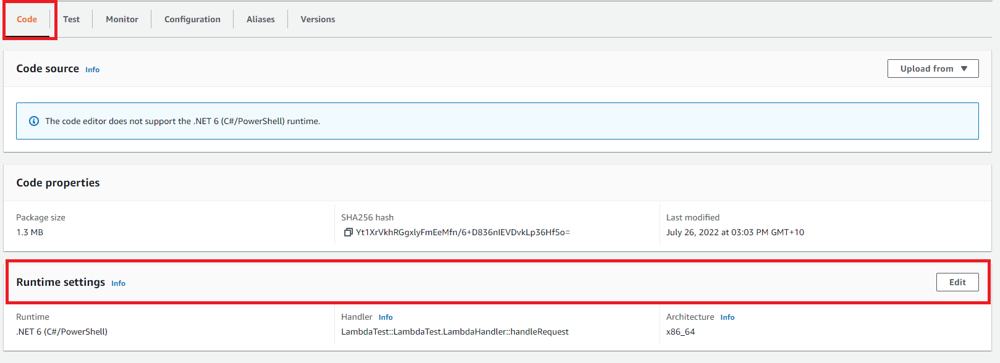

8) Update the Handler to “LambdaMinimalApi” (or whatever you chose to call your Assembly) and press save.

**For Blazor –** Make sure this is the assembly name of your server project. In the sample Github project this will be LamdbaBlazorCohosted.Server

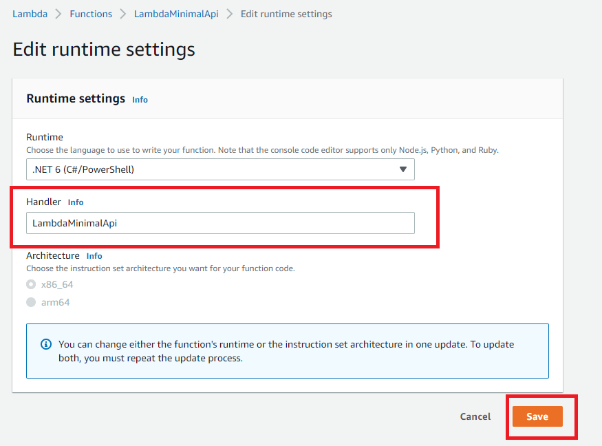

9) If you now hit the <baseurloflambda>/weatherforecast , you should get some weatherforecast data back as json in the response

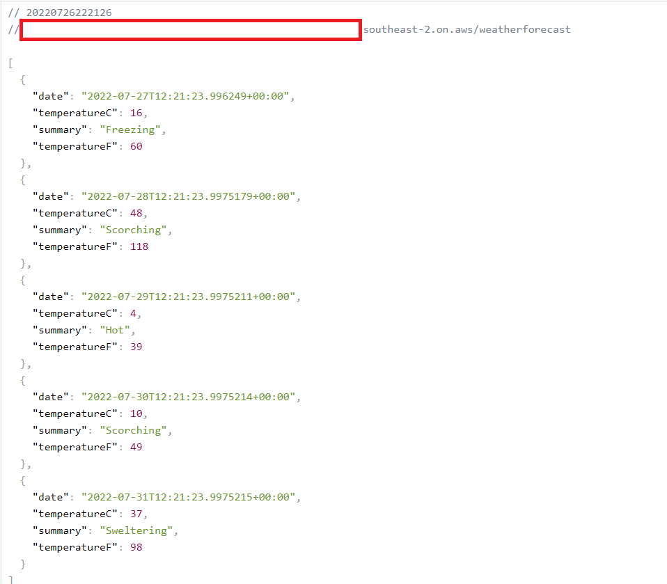

## Updates

I went and updated the code to include an http POST api as well, so that I can make sure it supports multiple APIs and the different http verbs. Below is the raw request. Update code is checked into Github.

POST https://<BaseUrl>.lambda-url.ap-southeast-2.on.aws/todoitems HTTP/1.1
User-Agent: Fiddler
Host: <BaseUrl>.lambda-url.ap-southeast-2.on.aws
Content-Length: 69
content-type: application/json

{
"id": 1,
"task":"Testing",
"start":"2012-04-23T18:25:43.511Z"
}

The code is quite simply as the service returns the data send in the request with a status code of 201 (Created).

HTTP/1.1 201 Created
Date: Tue, 26 Jul 2022 12:43:58 GMT
Content-Type: application/json; charset=utf-8
Content-Length: 60
Connection: keep-alive
x-amzn-RequestId: 9c2584be-30b1-47db-8717-825e35d37185
location: /todoitems/1
X-Amzn-Trace-Id: root=1-62dfe18e-679a237c0f777a8a206f5c44;sampled=0

{"id":1,"task":"Testing","start":"2012-04-23T18:25:43.511Z"}

It even served the swagger endpoint without any issues.

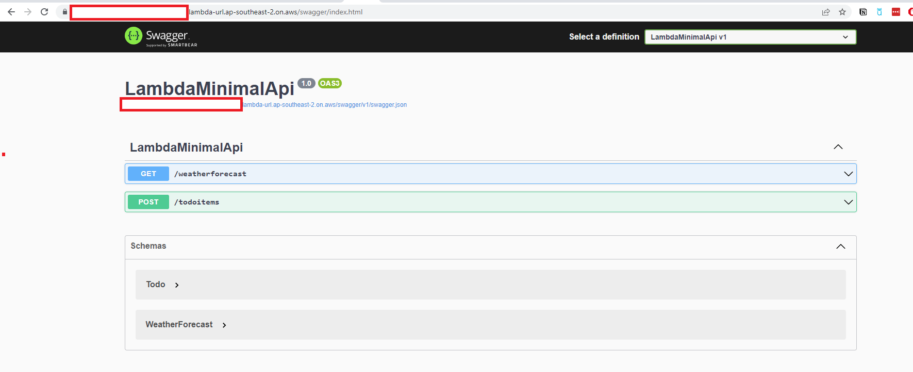

**For Blazor –** If you are testing with Blazor ASPNET hosted project , the home page should load the Blazor app home page.

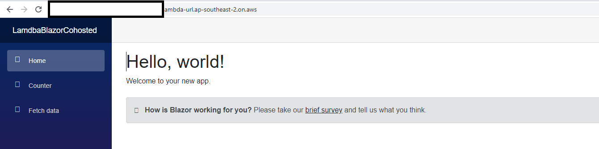

Icons are not loading because that is one of the resource I deleted to keep the package under 50MB


And the weather forecast api is called when the Fetch data page is loaded

## Conclusion

Now that was quite a simple process to get your Api’s hosted in AWS. The fact that you are still writing dotnet API code means you can change your mind any time about hosting it in Lambda. For example you can take the exact same code and deploy it to Azure web apps.
