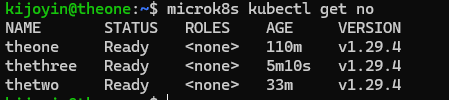
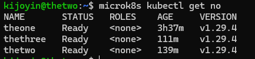
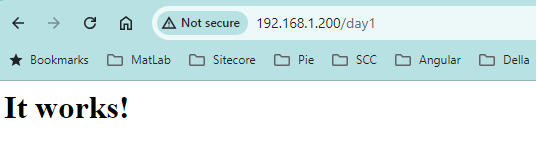
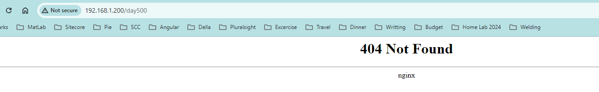

> Now, before anyone comments, I’m aware that there are other ways to prepare for a CKAD exam without setting up a full home lab with multiple nodes. However, I personally enjoy the concept of a home lab and have had different variations over the past few years (the latest being a docker swarm cluster). I’ve discussed this at [#dddBrisbane2023](https://www.dddbrisbane.com/) and you can find the slides [here](https://kiranjoy.blog/2023/12/03/home-labs-why-every-developer-should-build-one/). This is not an expert guide but the journey of a novice.

## Goals

These goals are not listed in any particular order or priority. Some of them are not meant to be achieved on day one, and there will be additional blog posts in the coming days chronicling my journey to accomplish all of these goals.

-   Set up a functioning cluster with at least one node and an application – **Done**.
-   Prepare and clear the [CKAD exam](https://www.cncf.io/training/certification/ckad/) – **In progress**.
-   Learn more about kubernetes – **In progress**.
-   Host a bunch of application at home, inlcuding this blog in the future – **ToDo**.
-   Make it highly available – **Done**.
-   Make the hardware look good and avoid any visible clutter – **ToDo**.
-   Make it manageable and replicatable, without having to spend hours of my life every week – **ToDo**.

## Hardware Requirements

I will be setting up a new cluter with a single control plane and 2 nodes and for the pursopse of persistent storage will be using a dedicated home server that has postrgress installed and well as an NFS share.

Inspriration for the hardware setup came from [this blog](https://www.servethehome.com/introducing-project-tinyminimicro-home-lab-revolution/) **(Introducing Project TinyMiniMicro Home Lab Revolution)** a few years ago and I have some of these tiny pc’s lying around and I might get a few more to expand the server capacity

Below are the servers and their specs on Day 1.

-   Lenova ThinkCentre M710q Core i3 6100 TU CPU @ 3.20 GHz.
    -   16 GB Ram
    -   465 Gb storage
-   Lenova ThinkCentre M710q Core i3.
    -   16 GB Ram
    -   465 Gb storage
-   Lenova ThinkCentre M73 Core i5.
    -   16 GB Ram
    -   1 TB storage
-   Storage server , yet to be decided.
-   Network swith to provide ethernet. Using an old Netgear GS108 8 port switch

## Sofware choices.

Ubuntu Server 24.04 LTS will be the server OS of choice for the control plane and the nodes. This was purely based on the fact that it was the latest Ubuntu server version as of Day 1 and secondly there are more resources on the internet for Ubuntu servercompared to other distros.

For the Kubernetes flavoud I chose [MicroK8s](https://microk8s.io/) 

## Why MicroK8s

Now in the past I have mostly used [K3S from rancher](https://www.rancher.com/products/k3s). While it is also quiet simple to setup with MicroK8s and Ubuntu both being from Canonical it feels like it is a lot easier to setup. Additionally MicroK8s has Vanilla Kubernetes and was quite easy to setup a high availability cluster with 3 nodes.

You can also run kubectl commands with MicroK8s. Below is my HA cluster all setup which took only around a hour, including the isntallation of Ubuntu on 3 servers.

## Installation

Now as mentioned the installation was pretty straight forward and since I chose Ubuntu Server 24.04 LTS MicroK8s can be installed as a snap package (and I checked the box while installing the OS) and that is pretty much what I have done.

Once all the three servers had MicroK8s installed, I pretty much opened the firewall on all the machines with the below commands (Keep in mind this might be bad idea for security but for day 1 this should be fine for a home lab)

sudo ufw allow in on cni0 && sudo ufw allow out on cni0
sudo ufw default allow routed

Additionally I also ran the current user to the ‘microk8s’ group, so I dont have to use sudo each time for microk8s

sudo usermod -a -G microk8s <UserId>
sudo chown -R <UserId> ~/.kube  # This one gave me some error but everything seem to work after the sudo reboot
sudo reboot

I have also run the below command to disable swap (the command basically add a hash to all lines that has the word swap in it in the /etc/fstab)

sudo sed -i '/ swap / s/^/#/' /etc/fstab

## Adding nodes to the cluster

At this point every node is it’s own cluster, so we need to add each node to the cluster. Following [the documentaion on mocrok8s website](https://microk8s.io/docs/clustering) is the easiest way to achieve this.

If you have 3 or more nodes, HA is enabled by default. You also have the option add nodes to the cluster with the **–worker** to add the node without the control plane features.

At this point if you run the following command in any of the nodes you should see all your nodes listed in there.

microk8s kubectl get no

## Networking

To expose our services running in Kubernetes , we will be using [MetalLB](https://metallb.universe.tf) and again we have a smple addon to install it. However make sure ingress is enabled as well. Detailed installation instrcutions can be found on the [MircoK8s website](https://microk8s.io/docs/addon-metallb).

microk8s enable ingress
microk8s enable metallb #You need to provide a pool of IPse

We also need a service for the ingress controller.

apiVersion: v1
kind: Service
metadata:
  name: ingress
  namespace: ingress
spec:
  selector:
    name: nginx-ingress-microk8s
  type: LoadBalancer
  # loadBalancerIP is optional. MetalLB will automatically allocate an IP 
  # from its pool if not specified. You can also specify one manually.
  # loadBalancerIP: x.y.z.a
  ports:
    - name: http
      protocol: TCP
      port: 80
      targetPort: 80
    - name: https
      protocol: TCP
      port: 443
      targetPort: 443

You can save this file as `ingress-service.yaml` and then apply it with:

microk8s kubectl apply -f ingress-service.yaml

We should be all good now but lets deploy a sample application and test it out.

Lets start by checking all the ingress class we have in the cluster.

kijoyin@theone:~$ microk8s kubectl get ingressclass
NAME     CONTROLLER             PARAMETERS   AGE
nginx    k8s.io/ingress-nginx   <none>       12h
public   k8s.io/ingress-nginx   <none>       12h

You can also see that MetalLb has provided us with an external IP for the ingress controller.

kijoyin@theone:~$ microk8s kubectl get svc -n ingress
NAME      TYPE           CLUSTER-IP       EXTERNAL-IP     PORT(S)                      AGE
ingress   LoadBalancer   10.152.183.105   192.168.1.200   80:31461/TCP,443:30680/TCP   11h

For a demo application lets deploy the [httpd](https://hub.docker.com/_/httpd) image to get a test response.

kijoyin@theone:~$ microk8s kubectl create ns day1
namespace/day1 created
kijoyin@theone:~$ microk8s kubectl create deployment demo --image=httpd --port=80 -n day1
deployment.apps/demo created
kijoyin@theone:~$ microk8s kubectl expose deployment demo -n day1
service/demo exposed

Now lets create an Ingress rule to expose the service outside the cluster. For more details on the ingress rule check the [official documentation](https://kubernetes.io/docs/concepts/services-networking/ingress/#ingress-rules).

apiVersion: networking.k8s.io/v1
kind: Ingress
metadata:
  name: day1-ingress-demo
  namespace: day1
  annotations:
    nginx.ingress.kubernetes.io/rewrite-target: /$1
spec:
  ingressClassName: public  # the public ingress class
  rules:
    - http: # you could also provide a host at the same level
        paths:
        - path: /day1
          pathType: Exact  # there are a few options here that we can  use
          backend:
            service:
              name: demo  # the name give to the service
              port:
                number: 80

Once the rule is created you should be able to access your service on the IP of the load balancer with the path you mentioned in the ingress rule.

For example in this case you use <LoadBalancerIP>/day1 and you should get the following response.

Any other path will return a not found error as we mentioned the path as exact in the rule we created above.

## Some thoughts

I think it is a pretty good place to endup on day 1. I have a cluster that is hightly available (i.e, If any one node dies , I still have the cluster up and running but it needs a minimum of 2 nodes to run) and we have a test application that we just deployed to make sure everything worked.

This is not a detailed blog about how to setup everything but more a documentation on my kubernetes home lab journey pieced together from countless blogs and documentation. For any details steps my recomendation is to go back to the official documentation on the product as it will be the most up to date resource.

## Resources

Below are some of the resources that I used to piece together everything above along with the official documentation.

-   [How to Enable and Expose Kubernetes Dashboard Using Microk8s in your home lab | Day 2](https://kiranjoy.blog/2024/08/01/how-to-enable-and-expose-kubernetes-dashboard-using-microk8s-in-your-home-lab-day-2/)
-   [https://medium.com/weles-ai/how-to-expose-the-kubernetes-application-68cb30ea15c7](https://medium.com/weles-ai/how-to-expose-the-kubernetes-application-68cb30ea15c7)
-   [https://benbrougher.tech/posts/microk8s-ingress/](https://benbrougher.tech/posts/microk8s-ingress/)
-   [https://jonathangazeley.com/2023/01/15/kubernetes-homelab-part-1-overview/](https://jonathangazeley.com/2023/01/15/kubernetes-homelab-part-1-overview/)

#### Make a one-time donation

Your contribution is appreciated.

[Donate](https://kiranjoy.blog/2024/07/02/how-to-build-a-high-availability-kubernetes-home-lab-with-microk8s-and-ubuntu-server-day-1/)
