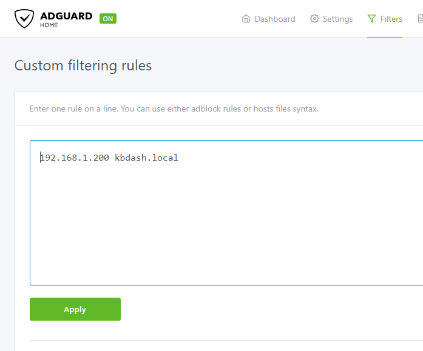
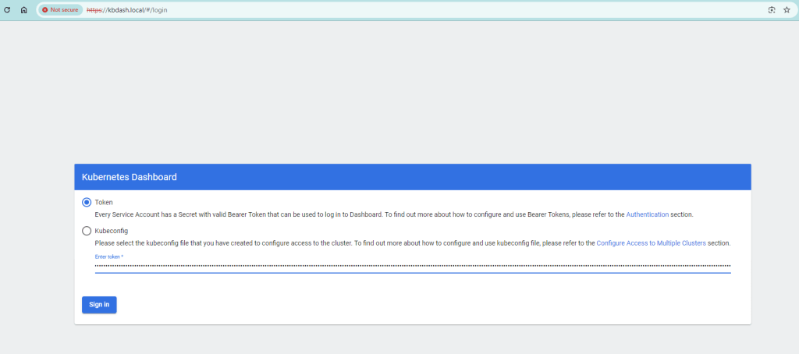
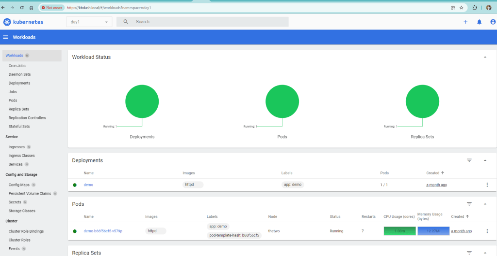

On [day 1](https://kiranjoy.blog/2024/07/02/how-to-build-a-high-availability-kubernetes-home-lab-with-microk8s-and-ubuntu-server-day-1/) we installed and configured a high availability Kubernetes cluster. Today we are going to enable the Kubernetes dashboard and expose it using a friendly name. Since we are using microk8s were going to use it to enable the dashboard and it is as simple as the below command

microk8s enable dashboard

Now that the dashboard is enabled, you can check the service by running the get service command.

 microk8s kubectl get service kubernetes-dashboard -n kube-system
NAME                   TYPE        CLUSTER-IP       EXTERNAL-IP   PORT(S)   AGE
kubernetes-dashboard   ClusterIP   10.152.183.152   <none>        443/TCP   30d

In our case there is no GUI on the kubernetes servers, so we need to be able to access it from any device on the network. For this we will be using the ingress controller we created to expose our demo application on day 1.

Lets create a new kb-dash-ingress.yml file and copy the below yml.

apiVersion: networking.k8s.io/v1
kind: Ingress
metadata:
  name: kb-dashboard
  namespace: kube-system
  annotations:
    nginx.ingress.kubernetes.io/backend-protocol: HTTPS  # This is important, otherwise we get a 400 bad request
spec:
  ingressClassName: public  # the public ingress class
  rules:
    - host: "kbdash.local"  # The friendly name we are going to use and will use adguard custom filters to point it to our lb
      http: 
        paths:
        - path: /
          pathType: Prefix # there are a few options here that we can  use
          backend:
            service:
              name: kubernetes-dashboard  # the name n to the service
              port:
                number: 443  #port dashboard is running

Lets apply it using the kubecly apply command.

microk8s kubectl apply -f kb-dash-ingress.yml

On line number 11, we added a friendly name and in my case i used kbdash.local. We have to tell our dns server to route kbdash.local to the IP address of our ingress load balancer.

microk8s kubectl get svc -n ingress
NAME      TYPE           CLUSTER-IP       EXTERNAL-IP     PORT(S)                      AGE
ingress   LoadBalancer   10.152.183.105   192.168.1.200   80:31461/TCP,443:30680/TCP   31d

Using the above command we can see that the ip of my ingress load balancer is 192.168.1.200. There are may ways to have this setup and in my case I chose AdGuard which I have used before. I ran my Adguard on a truenas scale server but you could also run them in your kubernetes server. I have also updated my router’s dns to point to Adguard.

Now if you open a browser and navigate to [https://kbdash.local](https://kbdash.local), you should see the kubernetes dashboard.

You need a token to login and you can get one by running the following comand

microk8s kubectl create token default

Copy the token and press Sign in.

Under the day 1 namespace we could see all the demo resources we created.

Security wasn’t a priority of this excercise and nothing is exposed outside the local network.

### Resources

-   [https://microk8s.io/docs/addon-dashboard](https://microk8s.io/docs/addon-dashboard)
-   [https://kubernetes.io/docs/concepts/services-networking/ingress/](https://kubernetes.io/docs/concepts/services-networking/ingress/)
-   [How to Build a High Availability Kubernetes Home Lab with MicroK8s and Ubuntu Server : Day 1](https://kiranjoy.blog/2024/07/02/how-to-build-a-high-availability-kubernetes-home-lab-with-microk8s-and-ubuntu-server-day-1/)
