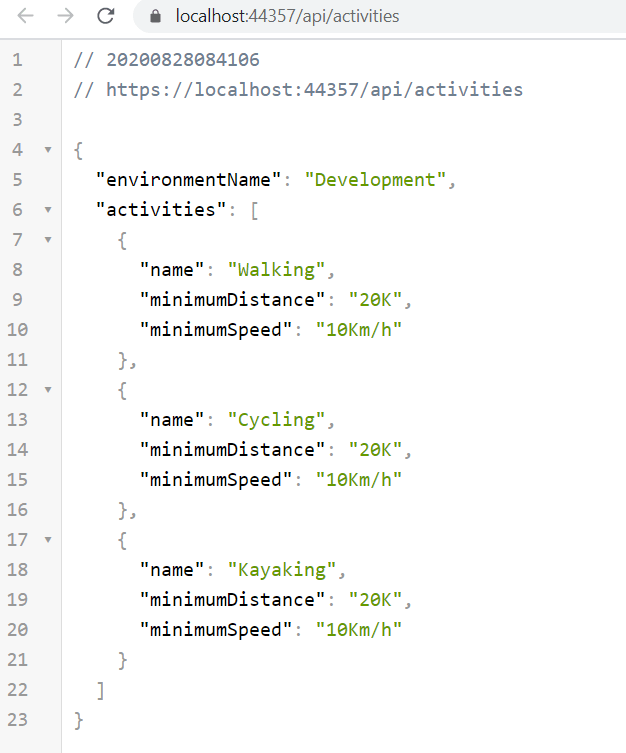
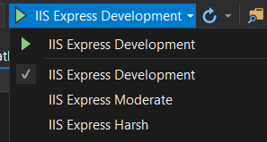
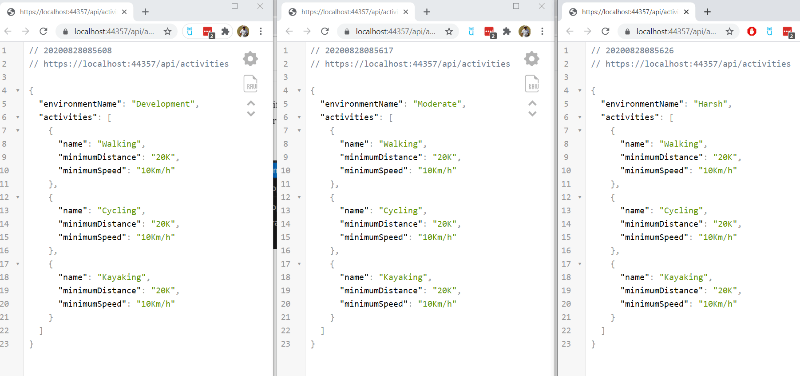
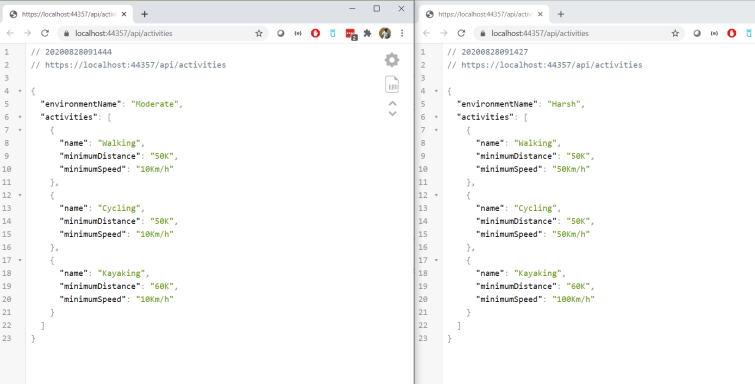
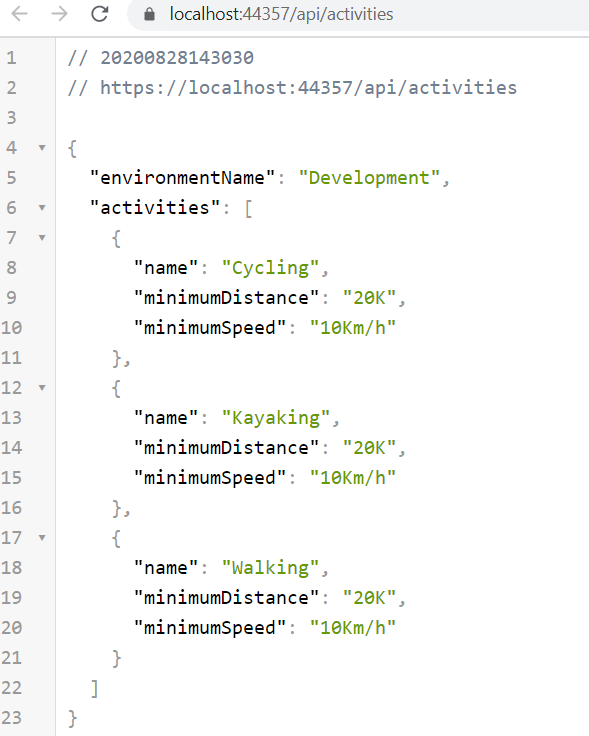
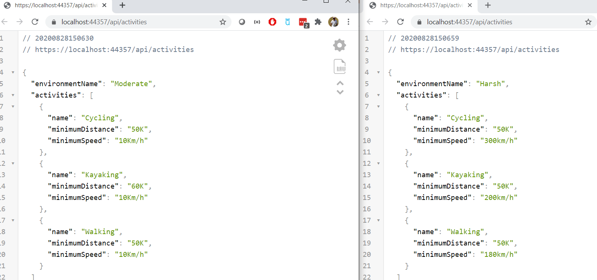

#### The final solution can be found in [Github](https://github.com/kijoyin/dotnetcoreconfigtransforms) if you want to check it out.

.NET Core’s configuration system is really powerful and is packed with a lot of features. However it get really complicated when you have a lot of environments to manage and you want to transform the values of array properties per environment. For the purpose of this tutorial we are going to looks at a config item called “Activites” which is an array of different activities you can do. Below is the default configuration we have and we want to transform the mimimumSpeed and minimunDistance for some environments

  "Acivities": \[
    {
      "name": "Walking",
      "minimumDistance": "20K",
      "minimumSpeed": "10Km/h"
    },
    {
      "name": "Cycling",
      "minimumDistance": "20K",
      "minimumSpeed": "10Km/h"
    },
    {
      "name": "Kayaking",
      "minimumDistance": "20K",
      "minimumSpeed": "10Km/h"
    }
  \],

Let us also create a C# class representing this config item as below.

// Activity.cs

using System;
using System.Collections.Generic;
using System.Linq;
using System.Threading.Tasks;

namespace ArrayTransforms
{
    public class Activity
    {
        public string Name { get; set; }
        public string MinimumDistance { get; set; }
        public string MinimumSpeed { get; set; }
    }
}

Let now add the configuration to the “ConfigureServices” in Startup.cs to make in available for the .NET core DI

// This method gets called by the runtime. Use this method to add services to the container.
        public void ConfigureServices(IServiceCollection services)
        {
            services.Configure<List<Activity>>(Configuration.GetSection("Acivities"));
            services.AddControllers();
        }

I have also went ahead and created a new Activities API controller so that we can see the activities returned along with the environment.

namespace ArrayTransforms.Controllers
{
    
    \[ApiController\]
    public class ActvitiesController : ControllerBase
    {
        private readonly IEnumerable<Activity> \_activities;
        private readonly IWebHostEnvironment \_hostingEnvironment;

        /// 

        /// Inject the activites config item and hosting environment 
        /// 

        /// <param name="activitiesOptions">Activites options</param>
        /// <param name="hostingEnvironment">To get the current environment name</param>
        public ActvitiesController(IOptions<List<Activity>> activitiesOptions, IWebHostEnvironment hostingEnvironment)
        {
            \_activities = activitiesOptions.Value;
            \_hostingEnvironment = hostingEnvironment;
        }

        \[Route("api/Activities")\]
        public dynamic GetAcitivities()
        {
            return new             {
                \_hostingEnvironment.EnvironmentName,
                Activities = \_activities
            };
        }
    }
}

The Activities Api returns the following data if we run it now. We can see that the current environment is “Development”. The data returned is the default configuration that we currently stored in out config file.

Lets now create a new environment called “Harsh”, were all these activities becomes a lot more difficult and another environment call “Moderate” were minimum distance will increase. We can mimic this by updating the “launchSettings.json” to add to more profiles with different ASPNETCORE\_ENVIRONMENT values.

{
  "iisSettings": {
    "windowsAuthentication": false,
    "anonymousAuthentication": true,
    "iisExpress": {
      "applicationUrl": "http://localhost:51056",
      "sslPort": 44357
    }
  },
  "$schema": "http://json.schemastore.org/launchsettings.json",
  "profiles": {
    "IIS Express Development": {
      "commandName": "IISExpress",
      "launchBrowser": true,
      "launchUrl": "api/activities",
      "environmentVariables": {
        "ASPNETCORE\_ENVIRONMENT": "Development"
      }
    },
    "IIS Express Moderate": {
      "commandName": "IISExpress",
      "launchBrowser": true,
      "launchUrl": "api/activities",
      "environmentVariables": {
        "ASPNETCORE\_ENVIRONMENT": "Moderate"
      }
    },
    "IIS Express Harsh": {
      "commandName": "IISExpress",
      "launchBrowser": true,
      "launchUrl": "api/activities",
      "environmentVariables": {
        "ASPNETCORE\_ENVIRONMENT": "Harsh"
      }
    }
  }
}

We can now run the different environments from Visual studio using the different profiles and running each of them will return the following different results.

As you can see the only different in the response currently is the environment name. All the activities has the same minimum distance and speed across all the environments.

We can now go and create environment specific configuration for the 2 new environments and for the Moderate environment we will increase the minimum distance, where as for the harsh one we want to increase the minimum speed also. For this , let’s add the environment specific configs for “Moderate” and “Harsh” environments. Lets duplicate “appsettings.json” and create 2 news settings file “appsettings.Moderate.json” and “appsettings.Harsh.json”

If you now check the appsettings.Moderate.json it looks something like below the only values that is different from the default configuration is the “minimumDistance”. However we are duplicating most of the default config to achieve the transform for just “minimumDistance”.

//appsettings.Moderate.json
{
  "Acivities": \[
    {
      "name": "Walking",
      "minimumDistance": "50K",
      "minimumSpeed": "10Km/h"
    },
    {
      "name": "Cycling",
      "minimumDistance": "50K",
      "minimumSpeed": "10Km/h"
    },
    {
      "name": "Kayaking",
      "minimumDistance": "60K",
      "minimumSpeed": "10Km/h"
    }
  \]
}

If we check “appsettings.Harsh.json” we can see a similar scenario were we are still duplicating the “name”. Running the API in those 2 environments returns the newly transformed data.

## Simplify the transforms

In order to minimise the transform configs , my first attempt was to see if I can access the array elements using the colon (:)

//appsettings.Moderate.json
{
  "Acivities\[0\]:minimumDistance": "50K",
  "Acivities\[1\]:minimumDistance": "50K",
  "Acivities\[2\]:minimumDistance": "60K"
}

However this seems to have no effect and even if it did work, using an array with indexing positions would be a nightmare to manage. If we change the order of the original config, you will have wrong values.

Inorder to fix this and to simply our configuration first we need to modify the original application setting as below. Instead of an array now we have different nested objects under activities. However we can still use List<Activity> to access this configuration item and .NET Cores configuration system is smart enough to map it.

"Acivities": {
    "Walking": {
      "name": "Walking",
      "minimumDistance": "20K",
      "minimumSpeed": "10Km/h"
    },
    "Cycling": {
      "name": "Cycling",
      "minimumDistance": "20K",
      "minimumSpeed": "10Km/h"
    },
    "Kayaking": {
      "name": "Kayaking",
      "minimumDistance": "20K",
      "minimumSpeed": "10Km/h"
    }
  }

Now if you run the Development environment you can see that it is still returning the activities.

Lets now add transform to both the Moderate and Harsh config . As you can see here, we are only listing the config items we are interested in changing.

// these are in 2 different files but for simplicity showed
// here as one
//appsettings.Moderate.json
{
  "Acivities:Walking:minimumDistance": "50K",
  "Acivities:Cycling:minimumDistance": "50K",
  "Acivities:Kayaking:minimumDistance": "60K"
}
//appsettings.Moderate.json
{
  "Acivities:Walking:minimumDistance": "50K",
  "Acivities:Walking:minimumSpeed": "180km/h",
  "Acivities:Cycling:minimumDistance": "50K",
  "Acivities:Cycling:minimumSpeed": "300km/h",
  "Acivities:Kayaking:minimumDistance": "50K",
  "Acivities:Kayaking:minimumSpeed": "200km/h"
}

If you now run the application in Moderate and Harsh environments you can now see the new values returned.

