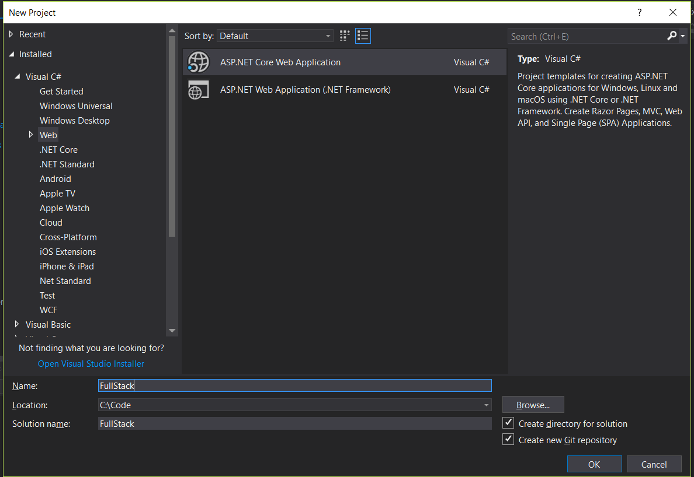
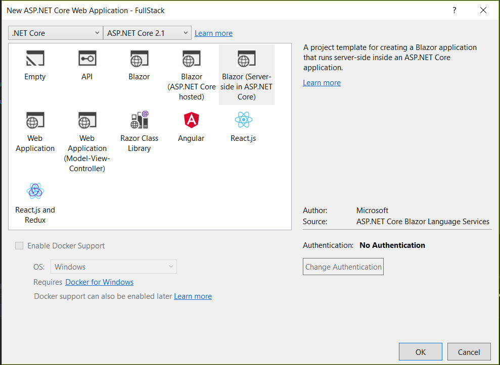
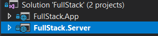
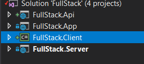
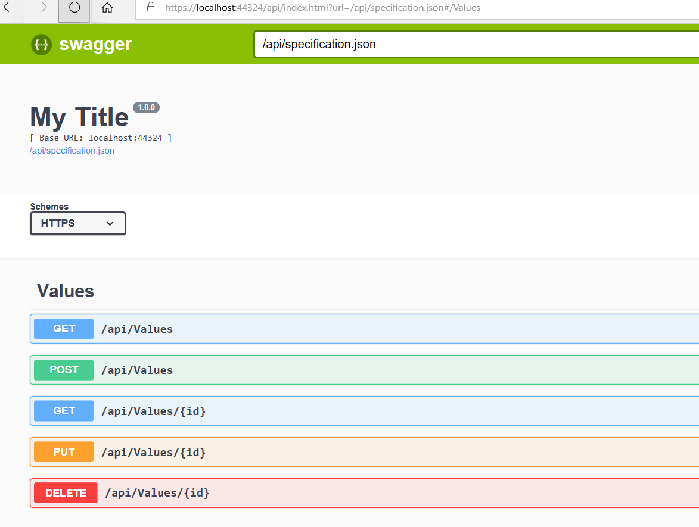
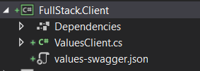
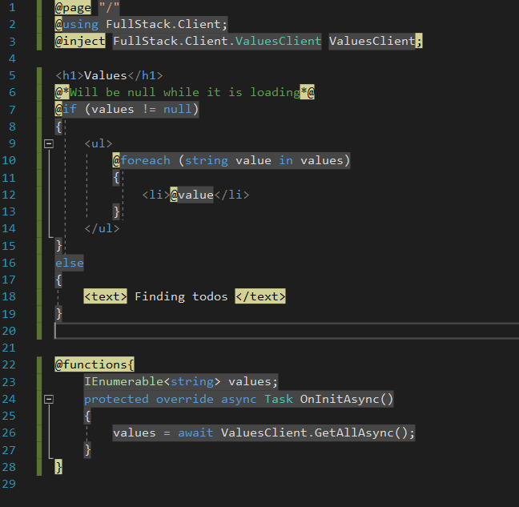
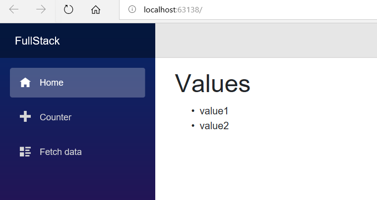

Blazor is an experimental .NET web framework using C# and HTML that runs in the browser. We will be looking into using the Blazer on Server with runs on server using the full DotNetCore and uses SignalR to provide nice SPA feel. Microsoft has announced that server-side Blazor will become first class citizen as part .NETCORE 3 with a new name Razor Components ([See Blazor update](https://visualstudiomagazine.com/articles/2018/10/03/blazor-update.aspx)). Client side Blazor will continue as an experiment.

In this tutorial we will be using the server-side Blazor that you can install using the below dotnet new command.

```
dotnet new -i Microsoft.AspNetCore.Blazor.Templates
```

## Solution Setup

Once the template is created let’s go an create a new Blazor Server project

1.  Create an ASP.NET Core Web Application in Visual studio  
    
    
    
2.  Select the Blazor (Server side in  ASP.NET Core) project template. Make sure ASP.NET Core 2.1 or higher is selected. I have used 2.1 in the interest of using a non preview version as 2.2 is still in preview at the time of writting.
    
    
    
3.  Your solution now contains 2 new projects the server and Ap
    
    
    
4.  Press Ctrl + F5 and you should have a Blazor server app running.
5.  Now let’s go an add a separate Web Api project to provide api services for our Blazor UI (You could use the Server project for the same but to decouple it I will be using a seperate web api project).
6.  Lets also add a .NET Standard class library and call it FullStack.Client. This will be become the API client that can be called from any .NET project.Your project should look something like this at this point.  
    
    
    

## Generate Swagger definition from FullStack.Api

We will be generating the client library using Swagger.json and NSwag.Msbuild. Lets start by adding the NSwag.AspNetCore nuget package to the FullStack.Api project, so that we can generate the swagger definition from code.

```
Install-Package NSwag.AspNetCore -Version 11.20.1
```

Update the ConfigureServices in startup.cs to AddSwagger

```
// This method gets called by the runtime. Use this method to add services to the container.
        public void ConfigureServices(IServiceCollection services)
        {
            services.AddMvc()
             .SetCompatibilityVersion(CompatibilityVersion.Version_2_1);

            services.AddSwagger();
        }
```

Also update the startup to configure swagger using the “UseSwaggerUi3WithApiExplorer” extension method.

```

// This method gets called by the runtime. Use this method to configure the HTTP request pipeline.
        public void Configure(IApplicationBuilder app, IHostingEnvironment env)
        {
            if (env.IsDevelopment())
            {
                app.UseDeveloperExceptionPage();
            }
            else
            {
                app.UseHsts();
            }

            app.UseHttpsRedirection();

            // Register the Swagger generator and the Swagger UI middlewares
            app.UseSwaggerUi3WithApiExplorer(settings =>
            {
                settings.SwaggerUiRoute = "/api";
                settings.SwaggerRoute = "/api/specification.json";
                settings.GeneratorSettings.DefaultPropertyNameHandling =
                    PropertyNameHandling.CamelCase;
            });

            app.UseMvc();
        }
```

Now if you run the Api project and navigate to /api swagger UI should load.



## Generating Api Client

Navigating to **[https://localhost:44324/api/specification.json](https://localhost:44324/api/specification.json)** will give you the swagger specification for our Values Api.

Lets create a new values-swagger.json file in the FullStack.Client Proect and copy the swagger definition to this file.

> Microsoft did announce that in future releases of .NET Core this process will be a lot more automated like adding a reference of the Api project in the client project.

Also add the nuget package for NSwag.MSBuild to FullStack.Client project

```
Install-Package NSwag.MSBuild -Version 11.20.1
```

Lets now edit the FullStack.Client Csproj and add the following target

```
<Target Name="NSwag" BeforeTargets="Build">
    <Exec Command="$(NSwagExe) swagger2csclient /input:values-swagger.json /namespace:$(RootNamespace) /InjectHttpClient:true /UseBaseUrl:false /Output:ValuesClient.cs" />
  </Target>
```

Now if we build the client project we should get ValuesClient.cs generated as seen below.



The generated client used Newtonsoft.Net and so we should add the Newtonsoft nuget package to the client project.

```
Install-Package Newtonsoft.Json -Version 11.0.2
```

## Using the client in our Blazor server project

Lets now add a reference to the FullStack.Client in FullStack.App and update the Startup class to inject the ValuesClient. For this we also need to add  
the nuget package Microsoft.Extensions.Http, so that we can inject the Http client.

```
Install-Package Microsoft.Extensions.Http -Version 2.1.1
```

Add the below code into ConfigureServices section of the startup class

```
services.AddHttpClient(httpClient =>
            {
                httpClient.BaseAddress = new Uri("https://localhost:44333");
                httpClient.Timeout = TimeSpan.FromMinutes(1);
            });
```

Replace the URI with the base url of your api.

Update Index.cshtml to display the values from the values api. Also in update the solution properties to run both the api project and the server project.



If we run the solution now we should see the home page loaded with the values from the values controller.



## Notes

1.  [Source code for the Solution used here can found in github](https://github.com/kijoyin/FullstackBlazor/tree/master)
2.  Everything here should also work with client side Blazor but I used server-side Blazor as it is more production ready than the client side one

## Further reading/viewing

1.  [Blazor Update](https://visualstudiomagazine.com/articles/2018/10/03/blazor-update.aspx)
2.  [Blazor](https://blazor.net/)
3.  [S207 – Blazor: Modern Web development with .NET and WebAssembly – Daniel Roth](https://www.youtube.com/watch?v=61qmX5eAPwI)
4.  [S104 – What’s New in ASP.NET Core?](https://www.youtube.com/watch?v=DDBmvOPfqzA)
